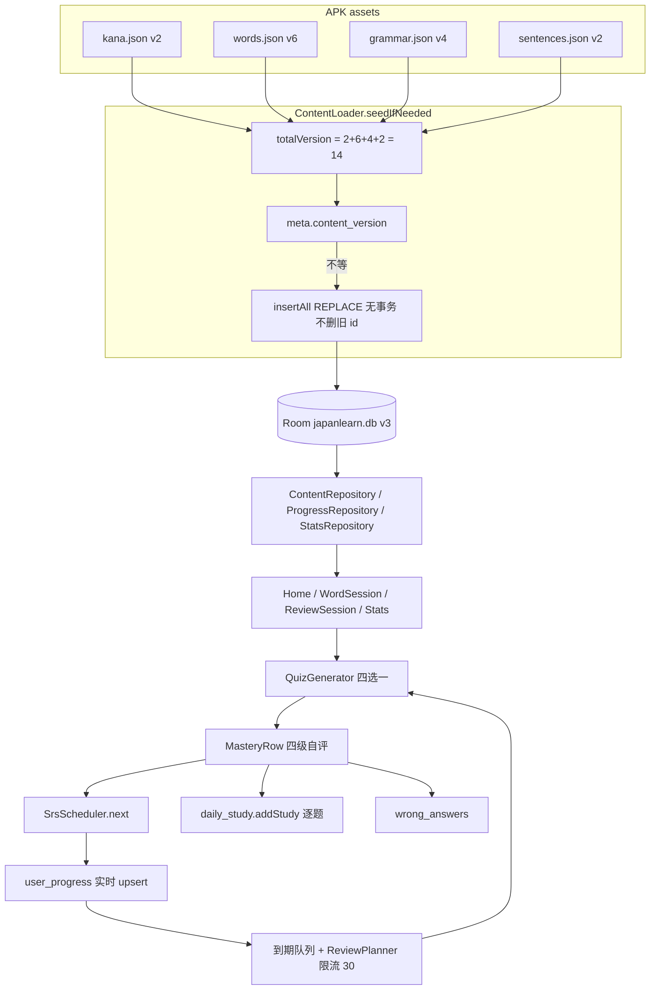
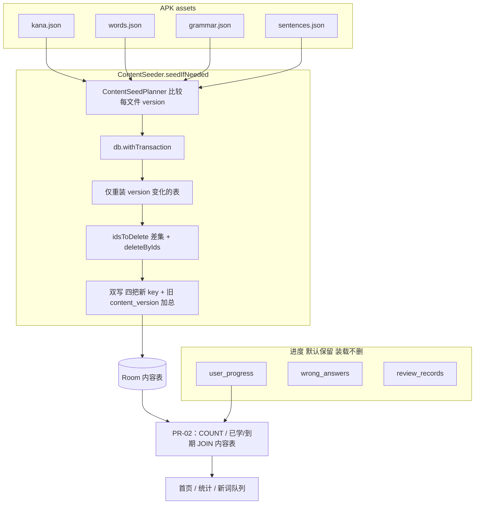
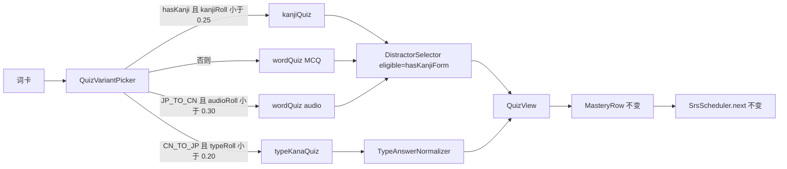
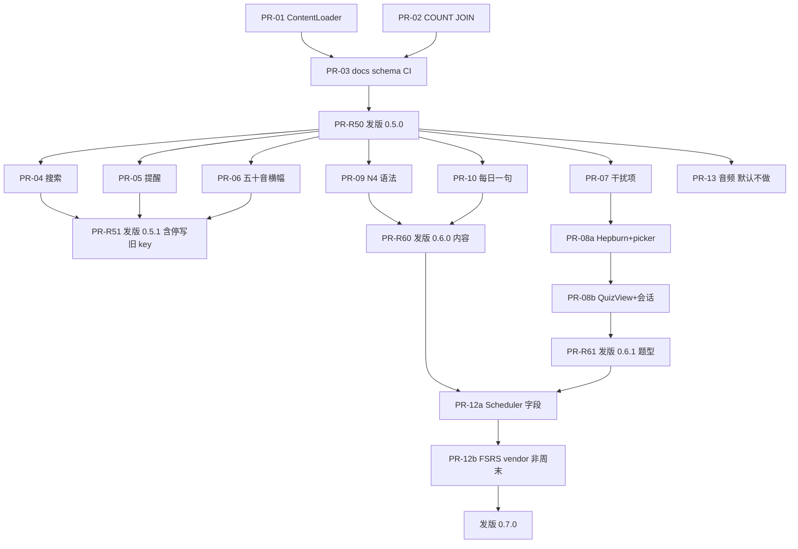

# JapanLearn 优化方案（v0.5+ 路线图与可实施技术设计）

| 项 | 值 |
|---|---|
| 文档标题 | JapanLearn 优化方案 v0.5+ |
| 作者 | （待填） |
| 日期 | 2026-09-09 |
| 状态 | **Accepted**（用户已确认 2026-09-09） |
| 适用范围 | 仓库 `E:\JapanLearn`（https://github.com/Ageha6912/JapanLearn） |
| 对齐文档 | `PRD.md` §17 / §18（冲突以它们为准）、`HANDOFF.md`、`README.md` |
| 建议写入 | 可作为 `PRD.md` **§19** 决策记录的候选正文（**本方案不改 PRD.md**） |
| 基线版本 | 代码 `versionName = "0.4.4"` / `versionCode = 10`（`app/build.gradle.kts`） |

---

## Overview

JapanLearn 已具备可日常使用的离线学习闭环（今日学习 → 即时练习 → 四级自评 SRS → 统计），但工程与内容层出现了三类会在后续版本放大的问题：内容装载用四个 JSON `version` **加总** 且无事务、无删除；首页/统计为计数收集全表；文档（README 55 测 / 504 词 / 30 句，HANDOFF v0.4.3 + Room v2）已与代码漂离。学习侧则缺少产出型题、干扰项仍接近随机、N4 语法与每日一句未按 HANDOFF 候选补齐。

本方案把优化拆成可独立评审、可回滚的 PR，映射到 **v0.5.x（工程债，不改学习科学）→ v0.6.0（内容，不等题型）→ v0.6.1（题型）→ v0.7（FSRS，先抽接口再 vendor）→ v0.8（预生成音频，默认不做）**。不引入后端、Hilt、账号或在线发音。每次改动必须 `./gradlew :app:testDebugUnitTest` 全绿；改内容必须 `python tools/validate_content.py` 通过。

**已锁定的产品决策（2026-09-09）**：orphan 进度保留、不级联删（D3）；v0.5–v0.6 继续系统 TTS、不为音频涨 APK（D7）；FSRS 不改四档中文按钮文案（D8）。

---

## Background & Motivation

### 已核实的代码事实（2026-09-09）

与审计摘要一致或已校正的项如下。**以代码为准，不以 HANDOFF/README 为准。**

| 项 | 代码事实 | 文档现状 |
|---|---|---|
| 版本 | `versionName = "0.4.4"` / `versionCode = 10`；工作树 HEAD `5fdc0cf`（`v0.4.3-1-g5fdc0cf`） | HANDOFF 写 v0.4.3、main `6ffb271`（HANDOFF 自己的哈希，不是 HEAD） |
| Room | `@Database(version = 3, exportSchema = false)`，已有 `MIGRATION_1_2`（kana.`groupName`）+ `MIGRATION_2_3`（words/grammar.`level`） | HANDOFF §5 仍写 version 2 |
| 测试 | 12 个测试文件、**77** 个 `@Test`；零 `@Preview`、零 `androidTest`、零迁移测试 | README badge「55 passing」；HANDOFF 写 77 |
| 内容 | kana 101（清 46 / 浊 25 / 拗 30，`version: 2`）；words 804（N5 504 + N4 300，`version: 6`）；grammar 80（N5 50 + N4 30，`version: 4`）；sentences 60（`version: 2`） | README 仍写 504 词 / 50 语法 / 30 句 |
| 内容版本存储 | `kana.version + words.version + grammar.version + sentences.version` = **14**，写入 `meta.content_version` | HANDOFF 只说「按版本重装入」 |
| 正式 APK | release `app-release.apk` **2,250,641 B ≈ 2.15 MB**（debug 18,983,823 ≈ 18.1 MB） | **README 不写 1.5 MB**。HANDOFF §2 与 PRD §18.4 仍写 R8 后 1.5 MB（v0.2 数字） |
| 源码规模 | 38 个 `app/src/main/java` `.kt`，**6821** 行（含空行；非空 6320） | 先前审计误写 6857 |

**内容装载（问题核心）** — `data/ContentLoader.kt` `seedIfNeeded()`：

- 读四个 assets JSON，算 `totalVersion`，与 `metaDao().get("content_version")` 比较，相等则整次跳过。
- **无** `withTransaction`。中途崩溃会留下半新半旧四张内容表。
- `insertAll(OnConflictStrategy.REPLACE)` 只覆盖同 id，**不删除**资产中已移除的 id。
- 四个文件只要加总不变（例如 words +1 且 grammar −1）就不会重装。

**计数** — DAO 已有 `WordDao.count()` / `GrammarDao.count()`（`suspend`，非 Flow），以及进度侧 `countWordFlow()` 等。但 `HomeViewModel`、`StatsViewModel`、`ProfileViewModel` 仍 `collect(app.content.wordsAll()) { s, v -> s.copy(totalWords = v.size) }`；`LearnViewModel` 为按级别统计收集全表再 `groupBy`。单词列表/错题本/出题池需要全表是合理的；**仅为 `.size` 收集 804 行不是。**

**学习科学（本阶段不改算法，只作后续接口约束）**：

- `domain/SrsScheduler.next(state, mastery, nowMillis)`：不认识 → `dueAt = now`；模糊 1 天；熟悉 `max(3, interval×1.5)`；熟练 `max(7, interval×2)` 上限 60 天。
- `QuizGenerator`：四选一；`AudioQuizPolicy` 30%（仅 `JP_TO_CN`）；`KanjiQuizPolicy` 25%（需汉字形）；看假名选汉字时 **同音异形不作干扰**（`it.kana != target.kana`），但普通词题干扰项是全池 `shuffled().take(3)`。
- `QuizWord` 目前只有 `id/ja/kana/zh`，**没有 `pos`/`cat`**，无法按词性抽干扰。
- 统计：`ProgressRepository.applyReview` 后由会话 `stats.addStudy(...)` **逐题实时落库**（`WordSessionViewModel.rate` / `GrammarSessionViewModel.rate` / `ReviewSessionViewModel.rate`）。

**TTS** — `util/JapaneseTts.kt` 已覆盖：无引擎超时、缺数据包、中文引擎谎报日语、`<queries>` 包可见性。点击决策纯函数 `decideAction`。真机发音仍是最大体验坑，但不在 v0.5 用体积换掉。

**设置** — `SettingsRepository` 与 `ContentRepository`/`ProgressRepository`/`StatsRepository` 同文件 `data/repositories/ProgressRepository.kt`，SharedPreferences + 手工 `MutableStateFlow`。提醒时间锁死 `ReminderScheduler.DEFAULT_HOUR = 20`；`ReviewReminder.schedule` 不读自定义时刻。

**UI 大文件**（ViewModel + Composable 同文件）：`Components.kt` 656、`ReviewScreens.kt` 520、`HomeScreen.kt` 494、`GrammarScreens.kt` 479、`WordScreens.kt` 471。

### 痛点（按用户可感知程度）

1. **内容更新不可靠**：加总版本、无事务、不删旧 id → 以后任何「删词 / 改 id / 只升其中一个 JSON」都会静默出错。
2. **文档不可信**：新人按 README 会以为还是 55 测 / N5-only / Room v2。
3. **练习偏再认**：只有四选一（含听音/汉字变体），没有默写/打字；干扰项随机，同词性/近义几乎不出现。
4. **N4 语法缺口**：HANDOFF 点名的 `～んです` / `～について` 确不在 `grammar.json`。现有 80 条里 N5 已含 `～ながら`（g35）、`～たり～たりする`（g45）、`～かもしれません`（g49）、`～なければなりません`（g44）；不能再按同 title 补 N4。真正缺的是解释语气、关于、逆接 `のに` 等（见 B3）。
5. **每日一句 60 条**按 `epochDay % size` 轮换，约两个月一轮；场景分布不均（日常 11 / 便利店 9 / 学校 7）。
6. **零基础首次打开**落在首页任务卡，没有「先学五十音」的轻引导。
7. **复习提醒**只有开关，时间写死 20:00。

---

## Goals & Non-Goals

### Goals

- **G1** 内容装载可事务、可按文件独立升级、可删除资产中已不存在的 id；进度 orphan 策略明确且有测试。
- **G2** 所有「只为计数」的全表收集改为 `COUNT` Flow；按级别统计改为 SQL 聚合。
- **G3** README / HANDOFF / 测试徽章 / Room schema 与代码一致；CI 增加 `validate_content.py`。
- **G4** 至少一种产出型题（假名打字/默写）进入 `QuizGenerator` 纯函数，带测试；干扰项按同词性优先并系统化「同音异形不作干扰」。
- **G5** 补 **7 条 title 与现有 80 条均不冲突** 的 N4 语法（80→**87**）；每日一句扩到约 120 条。合并前断言 title 集合不相交。
- **G6** 单词列表可搜索、按分类/掌握度筛选；提醒时刻可自定义；首页零基础五十音横幅（非多步 onboarding）。
- **G7** 抽出 `Scheduler` 接口（行为不变，可先行）；FSRS **实现**排在 G4/G5 之后，且必须钉死算法来源后才能开工（见 D12）。
- **G8** 发音：写清 TTS vs 预生成音频的体积/管线/回退；v0.5–v0.6 默认继续系统 TTS。

### Non-Goals（明确不做）

- 登录 / 云同步 / Firebase / 任何后端
- AI 日语助手
- 全球真人发音 / Forvo / UGC
- iOS
- Hilt（继续 `AppContainer` + `LocalAppContainer`）
- 把 debug APK 从 ~18 MB「优化」回更小（无产品价值）
- N4 单词二批（HANDOFF 候选，本方案不排期）
- Settings 迁 DataStore（可后续，**禁止**与 ContentLoader 绑同一个 PR）
- 大文件拆分不阻塞 v0.5；可作独立清洁 PR

### 产品不变式（Non-negotiable）

- 完全离线、无后端、无需账号
- 不引入 Hilt
- Tab 跳转必须 `NavHostController.navigateToTab()`（`MainActivity.kt`）
- 统计逐题实时落库，不改回会话结束才写
- Kotlin 块注释里不要写 `/*` 字面量（会触发嵌套注释编译失败）
- 设计系统沿用：和色、Manrope、固定头部+独立滚动、`ui/motion/Motion.kt`

---

## Key Decisions

| # | 决策 | 理由 |
|---|---|---|
| D1 | **增量 PR，禁止大爆炸重构**。功能 PR 一个人周末可完成；内容生产与 FSRS 实现单独标工时，不假装是周末编码。versionName 只在收口/发版 PR 改，不跟功能混。 | 仓库只有 38 个 kt / 77 测；HANDOFF 纪律是「有测试全绿才能交付」。 |
| D2 | 内容版本改为 **每文件独立 key**（`content_version_kana` 等）。一次启动包在 **一个** `withTransaction` 里。 | 加总会碰撞；分文件可只重装变更集；事务防止半更新。 |
| D3 | **保留 orphan 进度**（不级联删 `user_progress` / `wrong_answers` / `review_records`）。JOIN 计数在 **PR-02** 落地，不塞进装载 PR。**用户已确认 2026-09-09。** | 删进度不可逆。错题本 UI 已 `mapNotNull`。装载 PR 只保证不删进度行。 |
| D4 | v0.5 **不改** Simple SRS 公式。先抽 `Scheduler`（行为不变）；FSRS **实现**是独立 PR，算法未钉死前不得开工。 | PRD §17.5；接口提取与公式切换必须拆开，否则无法周末审完。 |
| D5 | 产出型题做 **看中文/汉字 → 打假名**（`WORD_TYPE_KANA`）。罗马音方案钉 **Modified Hepburn**，与 `words.json` 的 `romaji` 字段一致。`acceptedAnswers` **必须**含 `kana` 与 `romaji.lowercase()`。不做手写、不强依赖日语 IME。 | 词库已是 Hepburn（`watashi`/`taberu`/`shi`）；银行罗马音是转写失败时的保底。 |
| D6 | `DistractorSelector` **分桶取样、桶内 shuffle**：先耗尽同 `pos`，再同 `cat`，再其余。`eligible` 谓词给 `KANA_TO_KANJI` 传入 `hasKanjiForm`。`QuizWord` 增补 `pos`/`cat`（默认空串）。 | 全量 shuffle 会毁掉优先级；汉字题现网已过滤汉字形，不能丢。 |
| D7 | v0.5–v0.6 **继续系统 TTS**。预生成音频单开 v0.8，**默认不打进 APK、不为音频涨体积**。**用户已确认 2026-09-09。** | 当前正式包 2.15 MB；音频包预估 +5~25 MB，且有授权问题。PRD §17.4 已选 TTS。 |
| D8 | 四级自评按钮文案保持「不认识 / 模糊 / 熟悉 / 熟练」。FSRS 只在内部映射 Again/Hard/Good/Easy。**用户已确认 2026-09-09。** | 避免学习科学升级变成一次 UX 重学。 |
| D9 | Room `exportSchema = true`，schema JSON 入库 `app/schemas/`。KSP 路径用 `projectDir.absolutePath`。迁移测试走 **JVM**，CI 不上模拟器。 | ubuntu 单测 + assemble；androidTest 会拉长门禁。 |
| D10 | 版本号：**0.5.0** 工程债；**0.5.1** UX 小项；**0.6.0 内容**（语法+句子，不等打字题）；**0.6.1 题型**（干扰项+打字）；**0.7.0** FSRS 实现；**0.8.0** 音频包（可选）。 | 内容与题型无代码依赖；0.6.0 必须能在 0.6.1 之前发。 |
| D11 | **0.5.0 双写**四把新 key **以及**旧 `content_version = sum`，**不删除**旧 key。停写+删除旧 key 放在 **0.5.0 发布之后**的 chore PR（随 0.5.1 发版）。 | 回滚到 0.4.4 旧 APK 仍能认加总 key。0.5.0 自己删掉旧 key 会让「双写保回滚」变成空话。 |
| D12 | FSRS 实现 **vendor 精简移植** `open-spaced-repetition/ts-fsrs` **v5.4.2**（tag `v5.4.2`，commit `bb71e35`）。`enable_short_term = false`、`enable_fuzz = false`。卡片状态列名为 **`fsrsState`**（禁止叫 `state`，与现有 `status` 撞名）。Simple `next()` **必须 copy** 输入的 stability/difficulty/lapses/`fsrsState`，不得靠数据类默认值把多种子清零。产品不变式：**不认识 → `dueAt = now`**。`isMastered` 在 `Scheduler` 上，12b 同一提交改 `masteredWordCount` SQL。Kotlin 新列必须有默认值。 | 无 commit 无法对照 fixture；短时学习步与「本次再出」冲突；12a 若 `SrsState(...)` 只填四旧字段会在 12b 前把迁移种子写成 0。 |
| D13 | 罗马音转写表按 Modified Hepburn 最长匹配（见 B1 表）。语料金标：804 词 `romaji→kana` 允许列出例外，但用户键入词库 `romaji` 必须判对。 | 转写是便利；词库字段是契约。 |
| D14 | JOIN 版已学/到期计数与 COUNT Flow 同属 **PR-02**（`Daos.kt` 单一所有者）。PR-01 不改 count 查询。 | 避免两个周末 PR 同时改 `Daos.kt`；orphan 策略（不删进度）仍在 PR-01。 |

---

## Proposed Design

### 当前架构（学习闭环）



### 目标：内容装载



### 目标：练习变体选择（v0.6，不改 SRS）



### 分阶段目标

| 阶段 | 版本 | 主题 | 用户可感知变化 | 学习科学 |
|---|---|---|---|---|
| A1 | **v0.5.0** | 装载正确性 + COUNT/JOIN + 文档/schema | 几乎无 UI 变化；内容更新不再脏库 | 不变 |
| A2 | **v0.5.1** | 搜索筛选、提醒时刻、五十音横幅；停写旧 meta key | 设置与列表 UX | 不变 |
| B2 | **v0.6.0** | 7 条不冲突 N4 语法 + 每日一句 ×2 | 内容变多 | 不变 |
| B1 | **v0.6.1** | 打字题 + 智能干扰项 | 练习变难、更像「会不会」 | 题型变，SRS 不变 |
| C1a | 可先行 | 抽出 `Scheduler` + 可持久化字段，默认仍 Simple | 无 | 不变 |
| C1b | **v0.7.0** | vendor ts-fsrs 5.4.2 | 间隔更贴合；按钮文案默认不变 | 调度公式变 |
| C2 | **v0.8.0** | 预生成音频（**默认不做**；Q2 已否） | 无 TTS 引擎也能发音 | 不变 |

---

### A. 工程债（v0.5.x）

#### A1. ContentLoader：事务、分文件版本、删除缺失 id

**问题**

`ContentLoader.seedIfNeeded()`（`data/ContentLoader.kt`）三次缺陷叠加：

1. 版本加总碰撞。
2. 非事务：四个 `insertAll` 之间进程被杀 → 表不一致，且 `meta` 可能仍是旧值（下次会再试）或已是新值（再也不会修）。当前是 **先写四表再写 meta**，崩溃窗口是「内容已部分更新但版本未升」——会在下次启动重试，相对幸运；若以后有人把 meta 提前写就会永久脏。应用事务后两种顺序都安全。
3. `REPLACE` 不删 id。一旦将来从 `words.json` 去掉废词，Room 仍保留，新词队列/列表会多出幽灵行。

**方案**

把「读 JSON + 决策 + 写入」拆成可单测的纯规划器 + 薄 IO 层：

```kotlin
enum class ContentKind { KANA, WORDS, GRAMMAR, SENTENCES }

data class ContentVersions(
    val kana: Int,
    val words: Int,
    val grammar: Int,
    val sentences: Int,
) {
    companion object {
        val ZERO = ContentVersions(0, 0, 0, 0)
        fun fromMeta(get: (String) -> String?): ContentVersions = ContentVersions(
            kana = get(KEY_KANA)?.toIntOrNull() ?: 0,
            words = get(KEY_WORDS)?.toIntOrNull() ?: 0,
            grammar = get(KEY_GRAMMAR)?.toIntOrNull() ?: 0,
            sentences = get(KEY_SENTENCES)?.toIntOrNull() ?: 0,
        )
        const val KEY_KANA = "content_version_kana"
        const val KEY_WORDS = "content_version_words"
        const val KEY_GRAMMAR = "content_version_grammar"
        const val KEY_SENTENCES = "content_version_sentences"
        const val LEGACY_TOTAL = "content_version" // 只读迁移
    }
}

object ContentSeedPlanner {
    /** 仅当「有加总 key 且四把新 key 全缺」时视为旧安装，强制四文件重装。双写安装（新旧 key 并存）不得走这条。 */
    fun kindsToReload(installed: ContentVersions, incoming: ContentVersions, hasLegacyTotalOnly: Boolean): Set<ContentKind> {
        if (hasLegacyTotalOnly) return ContentKind.entries.toSet()
        return buildSet {
            if (installed.kana != incoming.kana) add(ContentKind.KANA)
            if (installed.words != incoming.words) add(ContentKind.WORDS)
            if (installed.grammar != incoming.grammar) add(ContentKind.GRAMMAR)
            if (installed.sentences != incoming.sentences) add(ContentKind.SENTENCES)
        }
    }

    /**
     * 计算应删除的旧 id。incoming 为空则拒绝（防止 NOT IN () 清空表）。
     * 半份 incoming 会删掉「差集」，调用方必须传入该文件的完整 id 列表。
     */
    fun idsToDelete(existing: Set<String>, incoming: Set<String>): List<String> {
        require(incoming.isNotEmpty()) { "incoming ids must not be empty" }
        return (existing - incoming).toList()
    }
}
```

写入伪代码（Kotlin 源码块注释禁止写 `/*` 字面量）：

```kotlin
class ContentLoader(private val readAsset: (String) -> String, private val db: AppDatabase) {
    suspend fun seedIfNeeded() {
        val kana = ContentJson.decodeFromString<KanaFile>(readAsset("kana.json"))
        val words = ContentJson.decodeFromString<WordsFile>(readAsset("words.json"))
        val grammar = ContentJson.decodeFromString<GrammarFile>(readAsset("grammar.json"))
        val sentences = ContentJson.decodeFromString<SentencesFile>(readAsset("sentences.json"))
        val incoming = ContentVersions(kana.version, words.version, grammar.version, sentences.version)

        db.withTransaction {
            val legacy = db.metaDao().get(ContentVersions.LEGACY_TOTAL)
            val hasLegacyTotalOnly = legacy != null && db.metaDao().get(ContentVersions.KEY_KANA) == null
            val installed = ContentVersions.fromMeta { db.metaDao().get(it) }
            val kinds = ContentSeedPlanner.kindsToReload(installed, incoming, hasLegacyTotalOnly)
            if (kinds.isEmpty()) return@withTransaction

            if (ContentKind.WORDS in kinds) reloadWords(words)
            if (ContentKind.KANA in kinds) reloadKana(kana)
            if (ContentKind.GRAMMAR in kinds) reloadGrammar(grammar)
            if (ContentKind.SENTENCES in kinds) reloadSentences(sentences)

            // D11：双写。0.5.0 不删除 LEGACY_TOTAL。
            db.metaDao().upsert(MetaEntity(ContentVersions.KEY_KANA, incoming.kana.toString()))
            db.metaDao().upsert(MetaEntity(ContentVersions.KEY_WORDS, incoming.words.toString()))
            db.metaDao().upsert(MetaEntity(ContentVersions.KEY_GRAMMAR, incoming.grammar.toString()))
            db.metaDao().upsert(MetaEntity(ContentVersions.KEY_SENTENCES, incoming.sentences.toString()))
            db.metaDao().upsert(
                MetaEntity(ContentVersions.LEGACY_TOTAL, incoming.total().toString()),
            )
        }
    }

    private suspend fun reloadWords(file: WordsFile) {
        val entities = file.words.mapIndexed { i, w ->
            WordEntity(w.id, w.ja, w.kana, w.romaji, w.zh, w.pos, w.cat, w.example, w.exampleZh, w.level, i)
        }
        require(entities.isNotEmpty())
        db.wordDao().insertAll(entities)
        val existing = db.wordDao().allOnce().map { it.id }.toSet()
        val incomingIds = entities.map { it.id }.toSet()
        val toDrop = ContentSeedPlanner.idsToDelete(existing, incomingIds)
        if (toDrop.isNotEmpty()) db.wordDao().deleteByIds(toDrop)
    }
}

private fun ContentVersions.total(): Int = kana + words + grammar + sentences
```

DAO 增量（PR-01 只要删除 API，不要改 count）：

```kotlin
@Query("DELETE FROM words WHERE id IN (:ids)")
suspend fun deleteByIds(ids: List<String>)
```

用 `IN (:ids)` 删除差集，而不是 `NOT IN (:keepIds)`：差集在正常更新里接近空，且 `idsToDelete` 已拒绝空 incoming。`ids` 为空则 **不调用** DAO。Room `IN` 上限约 999；当前词表 804，差集远小于此。kana / grammar / sentences 同样。

`JapanLearnApp.seedContent()` 必须包 `try/catch`：JSON 损坏只 `Log.e("ContentLoader", ...)`，不崩进程（今天 `onCreate` 里无 handler）。

`AppContainer` 继续 `ContentLoader(context, db)`，内部 `readAsset = { name -> context.assets.open("content/$name").bufferedReader().use { it.readText() } }`。

**Orphan 进度（默认 D3，PR-01 只做「不删」）**

不在 `reload*` 里删 `user_progress` / `wrong_answers` / `review_records`。JOIN 计数改写留给 **PR-02**（D14）。

`newWords` 已是 `id NOT IN (SELECT contentId FROM user_progress ...)`，orphan 行只会占一个 NOT IN 槽，**不会**把已删词再送进新词队列。

`BackupManager.import` 仍按 `(contentType, contentId)` 合并，不校验内容是否存在。不要在装载 PR 里改备份格式。

**触及文件（PR-01）**

- `data/content/ContentSeedPlanner.kt`（新）
- `data/ContentLoader.kt`
- `data/local/Daos.kt`（仅 `deleteByIds`；**不改** `countWordFlow` / `dueWordCount`）
- `JapanLearnApp.kt`（seed `try/catch Log.e`）
- 新测试 `ContentSeedPlannerTest.kt`

**测试（必须覆盖删除差集，不只规划器）**

- 加总碰撞：四文件 version 加总相同但单文件不同 → 只重装变化文件。
- 全相等 → empty set。
- 首次安装：installed 全 0、无 legacy → 四文件全重装。
- 仅有 legacy `content_version`、无 `content_version_kana` → 四文件全重装。
- 双写已存在（legacy 与 `KEY_KANA` 都在）→ `hasLegacyTotalOnly == false`，按每文件 version 比。
- `idsToDelete(existing, incoming)`：差集正确；`incoming` 空 → 抛；incoming 是完整新表时只返回被去掉的 id。
- 不引入 Android：规划器 + `idsToDelete` 纯函数。DAO 的 `DELETE IN` 本身不在 JVM 跑，但空列表不调用是 loader 侧断言，可用假 DAO 测「incoming 空不碰 delete」。

**风险**（高）：误把半份 id 当 incoming → 差集过大。缓解：`incomingIds.size == file.words.size && incomingIds.isNotEmpty()`；事务回滚。

**回滚（与伪代码一致，D11）**：0.5.0 双写加总 key，**不删** `content_version`。回滚到 0.4.4 APK 时旧代码仍读加总 key，可能再 `insertAll` 一遍（进度仍在）。停写旧 key 是 0.5.1 chore，不在本 PR。

---

#### A2. 首页/统计计数改 COUNT Flow

**问题**

`HomeViewModel`（`ui/home/HomeScreen.kt:108-109`）、`StatsViewModel`（`ui/stats/StatsScreen.kt:80-81`）、`ProfileViewModel`（`ui/profile/ProfileScreen.kt:85`）为 `.size` 收集 `wordsAll()` / `grammarAll()`。`LearnViewModel` 为按级别 `(总数, 已学)` 收集全表 + `wordMasteryMap()`。

单词学习会话 / 复习会话 / 错题本 / 单词列表继续全表是合理的（要展示或做题池）。

**方案**

DAO 增补：

```kotlin
@Query("SELECT COUNT(*) FROM words")
fun countFlow(): Flow<Int>

@Query("SELECT COUNT(*) FROM words WHERE level = :level")
fun countByLevelFlow(level: String): Flow<Int>

@Query("""
    SELECT COUNT(*) FROM words w
    INNER JOIN user_progress p ON p.contentId = w.id AND p.contentType = 'word'
    WHERE w.level = :level
""")
fun learnedCountByLevelFlow(level: String): Flow<Int>
```

kana / grammar 同样。`ContentRepository` 暴露 `wordCount()` / `grammarCount()` / `kanaCount()` / `wordCountByLevel(level)` / `learnedWordCountByLevel(level)`。

ViewModel 改 collect 这些 Flow。`LearnViewModel` 用 `combine(countByLevel(N5), learnedByLevel(N5), ...)` 填 `wordStats`，不再 `wordsAll().groupBy`。

本 PR **同时**把 D3 的 JOIN 计数落地（D14）：`countWordFlow` / `dueWordCount` / 语法对应项改为 `INNER JOIN` 内容表。到期**队列**已经 JOIN（`Daos.kt` `dueWords`）；到期**计数**今天没有。

**触及文件**：`Daos.kt`（COUNT Flow + JOIN 计数；本阶段 `Daos.kt` 的唯一所有者）、`ProgressRepository.kt`（ContentRepository 段）、`HomeScreen.kt`、`StatsScreen.kt`、`ProfileScreen.kt`、`LearnTabScreen.kt`。

**测试（计入 0.5.0 ≥90 门禁，必须是真断言）**

1. `app/build.gradle.kts` 把 `src/main/assets` 加进 unit test resources（或测试里 `File("app/src/main/assets/content/words.json")` 相对模块根；CI 在 repo 根跑 Gradle，用 `rootProject.file(...)` 更稳）。
2. `ContentScaleTest`：解码真实 `words.json` / `grammar.json` / `kana.json` / `sentences.json`，断言 size 为 **804 / 80 / 101 / 60**。这锁住「首页数字该等于 JSON 条数」。
3. JOIN 行为用纯函数测：`fun visibleLearned(progressIds: Set<String>, contentIds: Set<String>) = progressIds.intersect(contentIds).size` —— orphan id 不计入。

**风险**（低）：Flow 冷启动仍可能先发 0 再发 804——现有 UI 已按 0 显示，与 seed 竞态相同，v0.4.2 已接受。JOIN 在无删词的 0.5.0 与旧 `countWordFlow` 数值应相同。

**回滚**：恢复 `.size` collect 与非 JOIN count。

---

#### A3. 文档、Room schema、CI

**问题**

- README：badge 55、测试章节 55、功能表 N5 504/50、每日一句 30。
- HANDOFF：v0.4.3、Room v2、部分章节仍像 v0.3 进行中。
- `exportSchema = false`，无 schema 快照，迁移无法做差分审查。
- CI（`.github/workflows/ci.yml`）只跑单测 + assembleDebug + assembleRelease，**不跑** `validate_content.py`。

**方案**

1. `AppDatabase`：`exportSchema = true`。`app/build.gradle.kts`：

```kotlin
ksp {
    arg("room.schemaLocation", "${projectDir.absolutePath}/schemas")
}
```

提交 `app/schemas/com.japanlearn.app.data.local.AppDatabase/3.json`（构建一次生成）。以后每次升 version 必须提交新 JSON，否则 PR 一眼能看出来。

2. 抽出迁移 SQL 到 `data/local/AppMigrations.kt`，供 JVM 测试断言字符串（至少包含 `ALTER TABLE kana ADD COLUMN groupName` 与 `ALTER TABLE words ADD COLUMN level`）。不做模拟器。

3. README / HANDOFF 数字与版本改到与 0.5.0 一致（本 PR 发版时）。测试徽章改为动态或手写 77+本阶段增量。

4. CI 增加一步：

```yaml
- name: Validate content JSON
  run: python3 tools/validate_content.py
```

ubuntu-latest 自带 Python 3，无需新依赖。

**触及文件**：`AppDatabase.kt`、`app/build.gradle.kts`、`app/schemas/**`、`README.md`、`HANDOFF.md`、`.github/workflows/ci.yml`、新 `AppMigrations.kt` + `AppMigrationsTest.kt`。

**测试**：`AppMigrationsTest` 断言 1→2、2→3 SQL 含目标列名；schema 文件存在可用 `File` 测（CI checkout 后可见）。

**风险**（低）：KSP 生成 schema 的路径在 Windows 与 CI Linux 不一致——用 `projectDir.absolutePath` 消歧义。

**回滚**：文档可单独 revert；`exportSchema` 关掉不影响运行时。

---

#### A4. 可选清洁（不阻塞）

- **拆 Screen 文件**：按 `WordListScreen` / `WordSessionViewModel` 分文件，包名不变。每个文件一次 PR，避免与功能 PR 打架。
- **Settings DataStore**：另开议题。SharedPreferences 目前字段少（新词/语法/复习上限/提醒开关/学习级别/主题），没有损坏报告。禁止与 A1 绑定。

---

### B. 学习效果（v0.6.x）

#### B1. 产出型题：`WORD_TYPE_KANA`

**问题**

全部练习都是再认（四选一）。PRD §7.5 只写了日→中、中→日选择题。要提高「会写假名」必须有产出，但不能做成复杂输入法教程。

**方案**

扩展领域模型（保持 MCQ 字段，新增可选作答字段）：

```kotlin
enum class QuizKind {
    WORD_JP_TO_CN, AUDIO_WORD_JP_TO_CN, WORD_CN_TO_JP,
    KANA_TO_ROMAJI, GRAMMAR_FILL, KANA_TO_KANJI, KANJI_TO_KANA,
    WORD_TYPE_KANA, // 新增：看中文（及汉字形）打假名
}

data class Quiz(
    val kind: QuizKind,
    val question: String,
    val subQuestion: String?,
    val options: List<String>,      // 打字题为空列表
    val answerIndex: Int,           // 打字题 = -1
    val audioText: String? = null,
    val acceptedAnswers: List<String> = emptyList(), // 规范化后的可接受假名
    val inputPrompt: String? = null,
) {
    val isTypeAnswer: Boolean get() = kind == QuizKind.WORD_TYPE_KANA
    val answerText: String get() {
        check(!isTypeAnswer || acceptedAnswers.isNotEmpty()) { "WORD_TYPE_KANA requires acceptedAnswers" }
        return if (isTypeAnswer) acceptedAnswers.first() else options[answerIndex]
    }
}
```

```kotlin
object TypeAnswerPolicy {
    const val DEFAULT_CHANCE = 0.20
    fun shouldUse(direction: WordQuizDirection, roll: Double, chance: Double = DEFAULT_CHANCE): Boolean =
        direction == WordQuizDirection.CN_TO_JP && roll < chance
}

object TypeAnswerNormalizer {
    fun matches(raw: String, accepted: List<String>): Boolean {
        val n = normalize(raw)
        val rawFold = raw.trim().lowercase().replace(" ", "").replace("　", "")
        if (n.isEmpty() && rawFold.isEmpty()) return false
        return accepted.any { it == n || it == rawFold }
    }
    fun normalize(raw: String): String {
        val trimmed = raw.trim().lowercase().replace(" ", "").replace("　", "")
        val hira = romajiToHiragana(trimmed)
        return toHiragana(hira) // 片假名输入折到平假名；已经是平假名则原样
    }
    fun romajiToHiragana(romaji: String): String = longestMatch(romaji, HEPBURN)
}
```

**Modified Hepburn 最长匹配表（D13）**，与 `words.json` `romaji` 一致（`shi/chi/tsu/fu/ji`，不是训令式 `si/ti/tu/hu/zi`）：

| 优先级 | 键 | 平假名 |
|---|---|---|
| 3 拍拗音 | kya kyu kyo sha shu sho cha chu cho nya nyu nyo hya hyu hyo mya myu myo rya ryu ryo gya gyu gyo ja ju jo bya byu byo pya pyu pyo | きゃ…ぴょ |
| 促音 | 后接相同辅音的双写 `kk/ss/tt/pp/tch` | っ + 后一拍 |
| 拨音 | `n'`（元音/y 前）、`nn`、否则音节尾 `n` | ん |
| 2 拍 | ka–ko, sa **shi** su se so, ta **chi tsu** te to, na–no, ha hi **fu** he ho, ma–mo, ya yu yo, ra–ro, wa wo, ga–go, za **ji** zu ze zo, da de do, ba–bo, pa–po | 对应五十音 |
| 长音 | ou→おう, uu→うう, aa/ii/ee/oo；词库若写 macron（`āīūēō`）先折成双元音 | |
| 1 拍 | a i u e o | あいうえお |

语料金标测试：对 804 词跑 `romajiToHiragana(romaji) == kana`；失败项列入 `TypeAnswerNormalizerTest` 的 **allowlist**（预期极少，如助词读音写在整词 romaji 里）。**无论转写是否成功**，用户键入词库 `romaji` 都算对。

`QuizGenerator.typeKanaQuiz(target)`：

- `question = "“${target.zh}”的读音怎么写？"`
- `subQuestion =` 汉字形（`ja != kana` 时显示 `ja`），纯假名词不显示答案本身
- **`acceptedAnswers = listOf(target.kana, target.romaji.lowercase()).distinct()`**（D5；`QuizWord` 为此增加 `romaji: String = ""`）

**变体互斥**（抽到 `QuizVariantPicker`，ViewModel 不再嵌套 if）：

```kotlin
enum class WordQuizVariant { KANJI, AUDIO, TYPE_KANA, MCQ }

// 在现有 KanjiQuizPolicy 上增加重载，不要删 shouldUseKanji(ja, kana, roll)
fun KanjiQuizPolicy.shouldUseKanji(hasKanji: Boolean, roll: Double, chance: Double = DEFAULT_CHANCE): Boolean =
    hasKanji && roll < chance

object QuizVariantPicker {
    fun pick(
        direction: WordQuizDirection,
        hasKanji: Boolean,
        kanjiRoll: Double,
        audioRoll: Double,
        typeRoll: Double,
    ): WordQuizVariant = when {
        KanjiQuizPolicy.shouldUseKanji(hasKanji, kanjiRoll) -> WordQuizVariant.KANJI
        AudioQuizPolicy.shouldUseAudio(direction, audioRoll) -> WordQuizVariant.AUDIO
        TypeAnswerPolicy.shouldUse(direction, typeRoll) -> WordQuizVariant.TYPE_KANA
        else -> WordQuizVariant.MCQ
    }
}
```

**禁止**向 `shouldUseKanji(ja, kana, roll)` 传入 `"x","y"`——那会让 `hasKanjiForm` 恒为 false，现网 25% 汉字题会静默消失。`WordSessionViewModel.beginQuiz` 与 `ReviewSessionViewModel.makeQuiz` 都改走 picker；`hasKanji = KanjiQuizPolicy.hasKanjiForm(word.ja, word.kana)`。必测：`hasKanji=true, kanjiRoll=0.0` → `KANJI`。

**UI** — `QuizView`（`ui/components/Components.kt`）。现有签名是 `quiz, selected, onSelect, modifier, onSpeak`——**不重排旧参数**（会破所有调用点）。新增值参数插在 `onSpeak` 之前，**新增函数类型一律放最后**（HANDOFF 坑 2）：

```kotlin
fun QuizView(
    quiz: Quiz,
    selected: Int?,
    onSelect: (Int) -> Unit,
    modifier: Modifier = Modifier,
    typedDraft: String = "",
    typedResult: Boolean? = null, // null = 未提交
    onSpeak: ((String) -> Unit)? = null,
    onTypedDraftChange: (String) -> Unit = {},
    onTypeSubmit: () -> Unit = {},
)
```

- MCQ（`!quiz.isTypeAnswer`）：现有四选项。`LaunchedEffect(selected)` 的摇晃 **仅在 MCQ** 触发：`if (!quiz.isTypeAnswer && selected != null && selected != quiz.answerIndex) shakeTrigger++`。打字题不渲染 `quiz.options`。
- 打字题：`OutlinedTextField` +「确认」；对错用 `typedResult` + `FeedbackText`。**已作答守卫是 `typedResult != null`，不写 `selected`。** 之后仍然走 `MasteryRow`。

**会话计分（必须写进两个 VM）**

`WordSessionUiState` / `ReviewSessionUiState` 增加 `typedDraft: String`、`typedResult: Boolean?`。

```kotlin
fun submitTyped() {
    val s = _state.value
    val quiz = s.quiz ?: return
    if (!quiz.isTypeAnswer) return
    if (s.typedResult != null) return
    val ok = TypeAnswerNormalizer.matches(s.typedDraft, quiz.acceptedAnswers)
    _state.update {
        it.copy(
            typedResult = ok,
            // 不设置 selected：现网 QuizView 在 selected != answerIndex 时摇晃，
            // 打字题 answerIndex = -1，selected=0 会让对错都 shake。
            quizTotal = it.quizTotal + 1,
            quizCorrect = it.quizCorrect + if (ok) 1 else 0,
        )
    }
}
```

`onSelect` 路径保持 `quiz.answerIndex == index`，且只处理 `!quiz.isTypeAnswer`。打字路径 **禁止** 伪造 `answerIndex`，**禁止** 为挡重复提交而写 `selected`。复习会话同样加 `submitTyped()`（`correctCount` 对齐现有 `onSelect`）。

工时：Hepburn 表 + 语料金标是独立工作量。拆成 **PR-08a 领域（一个周末）** + **PR-08b UI/会话（一个周末）**，合入后才发 0.6.1。

**触及文件**：`domain/QuizGenerator.kt`、`TypeAnswerNormalizer.kt`、`QuizVariantPicker.kt`、`KanjiQuizPolicy.shouldUseKanji(hasKanji, roll)`、`QuizGeneratorTest.kt`、`TypeAnswerNormalizerTest.kt`、`Components.kt`、`WordScreens.kt`、`ReviewScreens.kt`。

**测试（必须）**

- `taberu` / `TABERU` / `たべる` / `タベル` 匹配 `たべる`（accepted 含 kana 与 romaji）
- 拨音/促音：`sensei` → `せんせい`；`nippon` → `にっぽん`（表驱动，不依赖词库是否有该词）
- 不匹配：`taberu` vs 目标 `のむ`
- 804 词语料金标 + allowlist
- picker：`hasKanji=true, kanjiRoll=0.0` → `KANJI`；`hasKanji=false` 永不 KANJI；`CN_TO_JP` 永不 AUDIO
- `typeKanaQuiz` 题干不含完整假名答案；`acceptedAnswers` 含 kana 与 romaji
- `submitTyped` 对/错都会增加 `quizTotal`，只有对才增加 `quizCorrect`（可用 VM 外的纯函数抽 `fun scoreTyped(ok, total, correct)`）
- **PR-08b 验收**：`submitTyped` 不改 `selected`；`QuizView` 摇晃与选项列表 gated on `!quiz.isTypeAnswer`；打字题已作答 = `typedResult != null`

**风险**（中）：转写边角。缓解已在主规格：`acceptedAnswers` 含词库 romaji，不再只写在「风险」段。

**回滚**：`TypeAnswerPolicy.DEFAULT_CHANCE = 0.0`。Quiz 新字段有默认值。

---

#### B2. 干扰项：同词性 / 同分类 / 同音排除

**问题**

`wordQuiz` 干扰项是全池 shuffle。汉字题已排除同 `kana`。词库 `pos` 分布：名词 445、动词 154、い形容词 65、副词 64、形容动词 29……同词性干扰对学习更狠。

**方案**

```kotlin
data class QuizWord(
    val id: String,
    val ja: String,
    val kana: String,
    val zh: String,
    val pos: String = "",
    val cat: String = "",
    val romaji: String = "",
)

object DistractorSelector {
    fun pick(
        target: QuizWord,
        pool: List<QuizWord>,
        answerOf: (QuizWord) -> String,
        count: Int,
        random: Random,
        excludeSameKana: Boolean,
        eligible: (QuizWord) -> Boolean = { true },
    ): List<String> {
        val base = pool.filter { it.id != target.id }
            .filter(eligible)
            .filter { !excludeSameKana || it.kana != target.kana }
            .filter { answerOf(it) != answerOf(target) }
        val samePos = base.filter { it.pos.isNotEmpty() && it.pos == target.pos }
        val sameCat = base.filter { it.cat.isNotEmpty() && it.cat == target.cat && it.id !in samePos.map { p -> p.id } }
        val rest = base.filter { it.id !in (samePos + sameCat).map { p -> p.id } }
        // 只在桶内 shuffle，跨桶顺序：pos → cat → rest。先耗尽同 pos。
        val ordered = samePos.shuffled(random) + sameCat.shuffled(random) + rest.shuffled(random)
        return ordered.map(answerOf).distinct().take(count)
    }
}
```

`wordQuiz` / audio：`eligible = { true }`。`kanjiQuiz(..., toKanji=true)`：**必须** `eligible = { KanjiQuizPolicy.hasKanjiForm(it.ja, it.kana) }`，否则现网测试「干扰项均为汉字形词汇」会红。`excludeSameKana = true` 用于日文形选项（`CN_TO_JP`、`KANA_TO_KANJI`、`KANJI_TO_KANA`）。

```kotlin
pool = app.content.wordsAll().first().map {
    QuizWord(it.id, it.ja, it.kana, it.zh, it.pos, it.cat, it.romaji)
}
```

**触及文件**：`QuizGenerator.kt`、`QuizGeneratorTest.kt`、`WordScreens.kt`、`ReviewScreens.kt`。

**测试**：保留箸/橋同音排除；汉字形过滤；人造小池「3 个同 pos + 若干其他」在任意 seed 下前 2 个干扰都是同 pos（**禁止跨桶 shuffle**）。

**风险**（低）：某 pos 只有 1 个词时退化为全池，与现在行为相同。

**回滚**：`DistractorSelector` 改回纯 shuffle。

---

#### B3. 内容：7 条 N4 语法 + 每日一句扩量

**问题**

`grammar.json` N4 现有 30 条（`～たら` … `～続ける`），缺 HANDOFF 点名的 `～んです` / `～について`。每日一句 60 条，`StatsRepository.sentenceIndexForToday` = `epochDay % size`。

**方案 — 语法**

新增 7 条（id 从现有最大 `g80` 续为 `g81`–`g87`），`level: "N4"`。批次 `tools/new_grammar_n4_b2.json`，`python tools/merge_grammar.py new_grammar_n4_b2.json`（`version` 4→5）。

**禁止再写已有 title。** 已核实冲突：`g35 ～ながら`、`g45 ～たり～たりする`、`g49 ～かもしれません` 会精确撞 `merge_grammar.py` 的 title 去重；`g44 ～なければなりません` 与「～なければならない」是同一教学点，不准再加一条。HANDOFF 只点名 `～んです / ～について`「等 7 条」——其余槽位改成真正缺失的 N4：

| id | title | 意义 | 与现网关系 |
|---|---|---|---|
| g81 | ～んです / ～のです | 解释/强调语气 | HANDOFF 点名；80 条中无 |
| g82 | ～について | 关于…… | HANDOFF 点名；80 条中无 |
| g83 | ～のに | 明明……却…… | 无此 title（N5 有 `ので`/`から`，不是同一点） |
| g84 | ～間 / ～間に | 在……期间 / 趁……的时候 | 无 |
| g85 | ～ところ | 动作阶段（正要/正在/刚刚） | 无 |
| g86 | ～てほしい | 希望对方做…… | N5 有 `～がほしいです`，不是补助动词 |
| g87 | ～によると | 据……说 | 传闻 `～そうだ` 已有，缺来源标记 |

成功标准 **80→87** 仅在这 7 个 title 全部合并成功时成立。PR-09 测试：`existingTitles intersect batchTitles == empty`；合并后 `grammar.size == 87` 且含 `～んです / ～のです`、`～について`。

`validate_content.py` **保持现网规则**：examples/exercises 非空、每道练习恰好 4 选项。实测 **75 / 80 条只有 1 道练习**（仅 g51/g52/g60/g62/g67 有 2 道）；examples 则全部 ≥2。把全局规则升为 `exercises >= 2` 会让 PR-09 被迫改写 75 道旧题，**不准这么做，也不准把 0.6.0 CI 门禁绑在这件事上。**

新 7 条批次 **单独**要求 `len(examples) >= 2` 且 `len(exercises) >= 2`：写在 PR-09 的 title-set 测试里（读 `tools/new_grammar_n4_b2.json`），不改 `validate_content.py` 全局。若将来要对全库加严，另开内容 PR。每条新练习干扰用相近语法（`のに` vs `ので` vs `から` vs `ても`），不要随机假选项。

**方案 — 每日一句**

扩到 **120** 条（再 60 条），场景仍限制在 `validate_content.py` 的 `SCENES` 七类，尽量补齐学校/工作（当前 7/7）。`sentences.json` version 2→3。

索引：条数翻倍后 `epochDay % 120` 已是四个月一轮，足够。额外做 **7 日内不重复** 没有必要（模运算本身无相邻重复直到整轮）。**不要**改 `sentenceIndexForToday` 公式，以免老用户「今天的句子」跳变；只扩表。若 size 从 60 变 120，同一天 `day % 120` 与旧 `day % 60` 可能不同——这是一次性换句，可接受。若要保持旧用户当天句子不变，用 `day % 60` 映射到「前 60 条仍按旧索引，新 60 条从下一轮插入」——过于花。**默认接受换句一次。**

Home 横条继续收集 `sentencesAll()` Flow（v0.4.2 竞态修复保留）。

**触及文件**：`app/src/main/assets/content/grammar.json`、`sentences.json`、`tools/new_grammar_n4_b2.json`、新 `tools/new_sentences_b2.json`（若写合并脚本；句子目前无 merge 脚本，可直接编辑或仿 `merge_grammar.py` 写 `tools/merge_sentences.py`，**本 PR 若新增脚本要同时给 README 一行用法**）。

**测试**：`python tools/validate_content.py` 必须过；`ContentParsingTest` 不测全量。可选：断言 title 集合包含 `～んです / ～のです`。

**风险**（中）：语法例句用字超出 N4、或与现有 title 重复被 merge 跳过。缓解：合并脚本已按 title 去重；人工过一遍 meaning。

**回滚**：把 JSON version 再 +1 并删新增条目（装载器会 `idsToDelete` + `deleteByIds` 掉新 id）。进度 orphan 保留无害。

---

#### B4. UX 小项（v0.5.1，可与 B 并行，建议先于题型发）

**B4a 单词列表搜索 + 筛选**

`WordListScreen` 已持有当前级别全量 `words`（列表必须全表）。在头部加：

- `OutlinedTextField` 搜 `ja/kana/romaji/zh`（大小写不敏感，trim）
- `FilterChip`：分类（`cat`，含「全部」）
- `FilterChip`：掌握度（未学 / 不认识 / 模糊 / 熟悉 / 熟练），映射 `masteryMap[id]`：`null` = 未学

纯 Compose 状态，不改 DAO。空结果走现成 `EmptyState`。

**触及**：`WordScreens.kt`。测试：抽出 `WordListFilter.matches(word, query, cat, mastery)` 纯函数 + 5 个测试，避免 UI 无测。

**B4b 提醒时间自定义**

`ReminderScheduler.nextTriggerDelayMillis` **已经**接受 `hour/minute`。缺口在持久化与调度入口。

`SettingsRepository` 增：

```kotlin
val reminderHour = MutableStateFlow(prefs.getInt(KEY_REMINDER_HOUR, ReminderScheduler.DEFAULT_HOUR))
val reminderMinute = MutableStateFlow(prefs.getInt(KEY_REMINDER_MINUTE, ReminderScheduler.DEFAULT_MINUTE))
```

`ReviewReminder.schedule(context, enabled, hour, minute)` 把 hour/minute 传入。`JapanLearnApp.onCreate` 恢复调度时读 settings。

UI：设置页与首页快捷卡片，Chip `18:00 / 19:00 / 20:00 / 21:00 / 22:00`（整点足够，不上 TimePicker）。文案去掉写死「每天 20:00」（`ProfileScreen.kt:288` 与 `HomeScreen.kt:406` 均为验收项）。

**WorkManager 精度**：现网 `PeriodicWorkRequestBuilder<ReviewReminderWorker>(1, TimeUnit.DAYS)` 受 15 分钟 flex / Doze 约束，**不是精确闹钟**。把 initialDelay 改成用户所选时刻，只能让「大约那一小时」更靠近目标，不能把 18:00 Chip 写成产品保证。本 PR 不换成 `AlarmManager.setExactAndAllowWhileIdle`（省电与权限面更大）。README/设置副文案写「大约在所选整点」。

**测试**：`ReminderSchedulerTest` 已覆盖非默认时刻的能力——补一条 `hour=21` 的延迟断言。`ThemeModeTest` 风格给 hour 解析一个 `coerceIn(0, 23)`。

**B4c 零基础五十音横幅**

不是 onboarding 流程。`SettingsRepository.kanaIntroDismissed` 默认 false。`showKanaIntro = !dismissed`。五十音不进 SRS（`recordKanaWrong` 只写错题本），不存在 `learnedKanaCount`；不要编造「已学假名数 == 0」条件。

横幅：首页任务卡上方一条 `SectionCard`，「还不会五十音？先花 10 分钟认平假名」+ 按钮 `nav.navigate(Routes.KANA)` + 文字按钮「暂时跳过」写 dismissed。设计系统：和纸底、固定头部不变、横幅在滚动区内。

**触及**：`HomeScreen.kt`、`SettingsRepository`、`MainActivity` 路由已有 `Routes.KANA`。

**测试**：`HomeKanaIntro.shouldShow(dismissed: Boolean) = !dismissed`。

**风险**（低）：横幅与今日一句横条同时出现显得挤。横幅放滚动区顶部，今日一句保持底部，不冲突。

---

### C. 发音与 SRS（独立版本）

#### C1. 发音：继续 TTS（默认）vs 预生成音频包

**现状**：`JapaneseTts` 三轮修复后仍依赖设备引擎。无 GMS ROM、未下载 ja-JP 数据包、中文引擎谎报 —— 引导路径已在 `TtsButton` + `decideAction`。

**方案 B 体积估算**（仅词头 + 每日一句，Ogg Opus 16 kbps mono）：

| 内容 | 条数 | 均长 | 体积 |
|---|---|---|---|
| 单词读音（`ja`） | 804 | ~1.2 s | ~1.9 MB |
| 单词例句 | 804 | ~2.5 s | ~4.0 MB |
| 语法例句 2 条 × 80 | 160 | ~2.5 s | ~0.8 MB |
| 每日一句 120 | 120 | ~2.0 s | ~0.5 MB |
| **合计（全开）** | | | **~7–10 MB** |
| 若用 24 kbps 或含语法讲解 | | | **10–25 MB**（与 HANDOFF 区间吻合） |
| 当前正式 APK | | | **2.15 MB** |
| 打包后预估 | | | **10–28 MB** |

构建管线（若做）：

1. 离线合成器在 CI **不跑**（避免 runner 装声库）；本地 `tools/gen_audio.py` 产出按内容类型分目录的 ogg。
2. 声库候选：Open JTalk / hts_voice_nitech（研究许可，商用需核对）或 VOICEVOX（角色许可，打包进 APK 通常要署名）。**授权未定时不准进 main。**
3. **id 命名空间**（现网 `w001` / `s01` / `g01` / `k01` 已经互不重叠，仍按类型分目录以免例句与词头撞 id）：

```
assets/audio/word/w001.ogg      # 词头 ja
assets/audio/word/w001.ex.ogg   # 可选例句
assets/audio/kana/k01.ogg
assets/audio/grammar/g01.ogg    # 第一条例句；更多用 g01.ex1.ogg
assets/audio/sentence/s01.ogg
```

4. 播放：`AudioPlayer.speak(contentType, id, fallbackText)` → 先 `assets/audio/$contentType/$id.ogg`，没有再 `JapaneseTts.speak`。
5. 离线承诺：音频在 APK 内，仍完全离线；不引入 CDN（与 PRD §17.1 / §17.4 一致）。

**已确认（D7，2026-09-09）**：v0.5–v0.6 不打包音频、不为音频涨 APK。v0.8 仍可选、默认不做；若将来重开，须另选可再分发声库，不在本路线图默认路径上。

**回退**：任何时候 TTS 引导路径保留。

---

#### C2. SRS → FSRS（拆成可编码的两段）

**现状**：`SrsScheduler.next` / `isMastered`；`applyReview` 只把 `mastery/intervalDays/reviewCount/dueAt` 写回实体，`status` 用 `SrsScheduler.isMastered`；统计页 `masteredWordCount(intervalDays >= 21)` 走 SQL，**不**走 Kotlin `isMastered`。

本方案把工作拆开。**PR-12a 可周末完成且行为不变；PR-12b 在算法钉死后才开工，不标周末。**

##### C2a. 抽出 `Scheduler` + 可持久化字段（行为不变）

```kotlin
interface Scheduler {
    fun next(state: SrsState, mastery: Mastery, nowMillis: Long): SrsState
    fun isMastered(state: SrsState): Boolean
}

object SrsScheduler : Scheduler {
    override fun next(state: SrsState, mastery: Mastery, nowMillis: Long): SrsState {
        val scheduled = when (mastery) {
            // 间隔 / dueAt / mastery / reviewCount 与现网完全一致
            else -> error("elided")
        }
        // 禁止 new SrsState(mastery, interval, count, dueAt) —— 默认值会把种子清零。
        return scheduled.copy(
            stability = state.stability,
            difficulty = state.difficulty,
            lapses = state.lapses,
            fsrsState = state.fsrsState,
        )
    }
}
```

必测：`SrsState(..., stability = 8.0, difficulty = 5.0, lapses = 1, fsrsState = "Review")` + `Mastery.KNOWN` → 输出 `stability == 8.0` 且 `fsrsState == "Review"`（间隔仍按 Simple 公式）。

`SrsState` / `UserProgressEntity` 增加（**Kotlin 默认值必须有**，否则旧备份反序列化失败；`ignoreUnknownKeys` 只忽略多余键，不补缺失属性）。列名是 **`fsrsState`**，不是 `state`：

```kotlin
data class SrsState(
    val mastery: Int,
    val intervalDays: Int,
    val reviewCount: Int,
    val dueAt: Long,
    val stability: Double = 0.0,
    val difficulty: Double = 0.0,
    val lapses: Int = 0,
    val fsrsState: String = "New", // New / Learning / Review / Relearning
)

@Entity(tableName = "user_progress", indices = [Index(value = ["contentType", "contentId"], unique = true)])
@Serializable
data class UserProgressEntity(
    @PrimaryKey(autoGenerate = true) val rowId: Long = 0,
    val contentType: String,
    val contentId: String,
    val mastery: Int,
    val intervalDays: Int,
    val reviewCount: Int,
    val dueAt: Long,
    val status: String,
    val learnedAt: Long,
    val lastReviewedAt: Long? = null,
    val stability: Double = 0.0,
    val difficulty: Double = 0.0,
    val lapses: Int = 0,
    val fsrsState: String = "New",
)
```

Room v3→v4 与 `MIGRATION_3_4` 放在 **C2a**（C2b 不再加列）：

```sql
ALTER TABLE user_progress ADD COLUMN stability REAL NOT NULL DEFAULT 0;
ALTER TABLE user_progress ADD COLUMN difficulty REAL NOT NULL DEFAULT 0;
ALTER TABLE user_progress ADD COLUMN lapses INTEGER NOT NULL DEFAULT 0;
ALTER TABLE user_progress ADD COLUMN fsrsState TEXT NOT NULL DEFAULT 'New';
UPDATE user_progress SET stability = CAST(intervalDays AS REAL), difficulty = 5.0, fsrsState = 'Review' WHERE intervalDays > 0;
```

`fallbackToDestructiveMigration()` 继续禁止。C2a 默认注入仍是 `SrsScheduler`。

`applyReview` 在 C2a 就接上读写（否则 C2b 会「算了但没存」）：

```kotlin
val previous = existing?.let {
    SrsState(
        mastery = it.mastery,
        intervalDays = it.intervalDays,
        reviewCount = it.reviewCount,
        dueAt = it.dueAt,
        stability = it.stability,
        difficulty = it.difficulty,
        lapses = it.lapses,
        fsrsState = it.fsrsState,
    )
} ?: SrsState.INITIAL
val next = scheduler.next(previous, mastery, now)
db.progressDao().upsert(
    UserProgressEntity(
        rowId = existing?.rowId ?: 0,
        contentType = contentType,
        contentId = contentId,
        mastery = next.mastery,
        intervalDays = next.intervalDays,
        reviewCount = next.reviewCount,
        dueAt = next.dueAt,
        status = if (scheduler.isMastered(next)) "mastered" else "learning",
        learnedAt = existing?.learnedAt ?: now,
        lastReviewedAt = now,
        stability = next.stability,
        difficulty = next.difficulty,
        lapses = next.lapses,
        fsrsState = next.fsrsState,
    ),
)
```

`masteredWordCount` SQL 在 C2a **先保持** `intervalDays >= 21`（Simple 语义不变）。C2b 再改。

C2a 测试：原 10 项全绿；**种子 `stability=8` + `Mastery.KNOWN` → 仍为 8**；备份缺新字段仍能 parse。

##### C2b. FSRS 实现（v0.7，非周末）

**算法钉死（D12）**：vendor 精简移植 [ts-fsrs v5.4.2](https://github.com/open-spaced-repetition/ts-fsrs/releases/tag/v5.4.2)（commit `bb71e35`）的 scheduler（`fsrs()` / `createEmptyCard` / `Rating` / `State` / 默认 `w[]`）。源文件头注释写明 tag 与 commit。不引入 npm；不从论文手写 19 个权重。MIT。

调度器参数钉死：

- `enable_fuzz = false`（向量测试稳定）
- **`enable_short_term = false`**（短时 1m/10m 学习步与「不认识 → dueAt=now、会话重出队」冲突）
- `maximum_interval = 60`（现网上限；在移植文件里标明 vs ts-fsrs 默认 36500）

评级映射：UNKNOWN→Again(1)、FUZZY→Hard(2)、KNOWN→Good(3)、MASTERED→Easy(4)。按钮文案不改（D8）。

**Card → `UserProgressEntity` / `SrsState`（禁止用 intervalDays/lapses 反推 State）**

| ts-fsrs `Card`（5.4.2） | 本库列 / 字段 | 备注 |
|---|---|---|
| `due` | `dueAt` | Again 之后 **覆盖为 `nowMillis`** |
| `stability` | `stability` | |
| `difficulty` | `difficulty` | |
| `scheduled_days` | `intervalDays` | 取整天数 |
| `reps` | `reviewCount` | |
| `lapses` | `lapses` | |
| `last_review` | `lastReviewedAt` | |
| `state`（New/Learning/Review/Relearning） | **`fsrsState TEXT`** | 存枚举名；**列名不是 `state`** |
| `elapsed_days` | 不落库 | 每次 `next` 用 `now - lastReviewedAt` 现算 |
| `learning_steps` | 不落库 | `enable_short_term = false` 时不用 |

`FsrsScheduler.next`：把 `SrsState` 填成 `Card`（`state = CardState.valueOf(fsrsState)`），调用移植的 `scheduler.next`，再按上表写回。**不得**用 `intervalDays==0 && lapses>0` 之类启发式重建 Relearning。

**不认识 / 会话重出队（钉死）**：FSRS Again 仍更新 S/D/lapses/`fsrsState`，然后 **覆盖 `dueAt = nowMillis`**。不把 Again 变成 1–10 分钟学习步。

`FsrsScheduler.isMastered`：`stability >= 21`（对齐 `MASTERED_INTERVAL_DAYS`）。**同一 PR** 改

```kotlin
@Query("SELECT COUNT(*) FROM user_progress p INNER JOIN words w ON w.id = p.contentId WHERE p.contentType = 'word' AND p.stability >= :threshold")
fun masteredWordCount(threshold: Int): Flow<Int>
```

调用处传入 21。Simple 注入时 C2a 的 SQL 仍用 intervalDays——因此 C2b 切换默认调度器与 SQL 必须同一提交，避免「Kotlin 说已掌握、SQL 说没有」。

备份：`BackupFileSchema.VERSION = 2`；`normalizeForImport`：若 `stability==0 && intervalDays>0` 则 `stability=intervalDays.toDouble()`。实体默认值已在 C2a。

测试：从 ts-fsrs 5.4.2 的 fixture / 文档示例移植至少：新卡 Good 后 interval 上升；Again 后 S 下降且我们的 `dueAt==now`；Easy > Good。保留 `SrsSchedulerTest` 10 项。

**风险**（中）：`stability = intervalDays` 种子不是严格 FSRS。缓解：迁移不改已有 `dueAt`，只在下次自评生效。

**回滚**：`AppContainer` 改回 `SrsScheduler`；v4 列保留；C2b 不得从树上删除 `MIGRATION_3_4`。

---

## API / Interface Changes

### ContentRepository

```kotlin
// 现有
fun wordsAll(): Flow<List<WordEntity>>
// 新增
fun wordCount(): Flow<Int>
fun grammarCount(): Flow<Int>
fun kanaCount(): Flow<Int>
fun wordCountByLevel(level: String): Flow<Int>
fun learnedWordCountByLevel(level: String): Flow<Int>
fun grammarCountByLevel(level: String): Flow<Int>
fun learnedGrammarCountByLevel(level: String): Flow<Int>
```

### SettingsRepository

```kotlin
val reminderHour: MutableStateFlow<Int>
val reminderMinute: MutableStateFlow<Int>
fun setReminderTime(hour: Int, minute: Int)
val kanaIntroDismissed: MutableStateFlow<Boolean>
fun setKanaIntroDismissed(value: Boolean)
```

### Quiz / Scheduler

见 B1、C2 伪代码。`applyReview` 签名不变，C2a 起读写 stability/difficulty/lapses。`QuizView` 新增可选参数且新函数类型放最后；不重排现有 `onSelect`。

### ReviewReminder

```kotlin
fun schedule(context: Context, enabled: Boolean, hour: Int = ReminderScheduler.DEFAULT_HOUR, minute: Int = ReminderScheduler.DEFAULT_MINUTE)
```

`JapanLearnApp.onCreate` 改为传入 settings 的时分。

---

## Data Model Changes

### 内容 JSON

无 schema 破环。单词已有 `pos`/`cat`/`level`。语法/句子只增条目并升 `version`。

### Room

| 版本 | 何时 | 变更 |
|---|---|---|
| 3（当前） | v0.3 | words/grammar.`level` |
| 3 保持 | v0.5.0 | **不升 version**。只改查询与 meta 行。`exportSchema` 补交 3.json |
| 4 | C2a | `stability` / `difficulty` / `lapses` / **`fsrsState TEXT NOT NULL DEFAULT 'New'`**（Kotlin 默认 0 / `"New"`）。已有 `intervalDays>0` 的行种子为 Review |

v0.5.0 **不加** `MetaDao.delete`。停写旧 key 的 chore 才加 delete。

### 迁移策略

- 正向：`addMigrations(MIGRATION_1_2, MIGRATION_2_3, MIGRATION_3_4)`，禁止 `fallbackToDestructiveMigration()`。
- 测试：JVM 断言 SQL 文本；schema JSON 入库做 PR diff。
- **D11 双写**：0.5.0 写四把新 key **和** 旧 `content_version = sum`，不删旧 key。0.5.1 chore：停止写入旧 key，再 `delete(LEGACY_TOTAL)`。

### 备份

v0.5 不改 `BackupFile.version`。v0.7 升 `BackupFileSchema.VERSION = 2`，`normalizeForImport` 补种 stability。

---

## Alternatives Considered

### 1. 大爆炸重构 vs 增量 PR（选增量，D1）

| | 大爆炸（一个 PR 装载+FSRS+题型+拆文件） | 增量（本方案） |
|---|---|---|
| 评审 | 无法审 | 每个 PR < 约 400 行有效 diff |
| 回滚 | 只能整包撤 | 按版本回撤 0.6 不影响 0.5 装载修复 |
| 测试 | 失败时难定位 | 失败限定在规划器/题型/内容 |
| 风险 | 高：HANDOFF 已有多次「表面无关改动」踩坑 | 低 |

大爆炸唯一优点是少打几个 versionName。不足以抵消 77 个测试的定位成本。

### 2. FSRS 现在做 vs 后做；手写 vs vendor（选后做 + vendor，D4/D12）

| | 塞进 0.5 并手写公式 | 抽出接口（C2a）后 vendor ts-fsrs 5.4.2（C2b） |
|---|---|---|
| 用户价值 | 无使用数据可校准 | 先用产出型题拉高 rating 质量 |
| 可实现性 | 19 权重 + 短时记忆步无测试向量 | commit `bb71e35` 可对照 fixture |
| PR 体积 | 装载+FSRS 无法审 | C2a 周末；C2b 单独标工时 |
| 风险 | 进度 bug 会被当成装载 bug | 隔离；Again 覆盖 `dueAt=now` 保住会话重出队 |

不选 `open-spaced-repetition/FSRS-Kotlin` 作为钉死来源：提交少、标 FSRS-6，和 ts-fsrs 5.4.2 向量对不上。

### 3. 继续系统 TTS vs 预生成音频（已选 TTS，D7 用户确认 2026-09-09）

| | 系统 TTS | 预生成 Opus 打包 |
|---|---|---|
| APK | 2.15 MB | 10–28 MB |
| 离线 | 依赖设备引擎+日语包 | APK 内自包含 |
| 授权 | 无 | 声库许可未决 |
| 音质 | 因 ROM 而异，已有三轮引导 | 可控、一致 |
| 真机坑 | 仍是最大体验问题 | 可根治「无声」 |

不选「CDN 预生成」（违反完全离线）。不选 Forvo（违反无后端 + UGC）。

### 4. Orphan 保留 vs 级联删除（已选保留，D3 用户确认 2026-09-09）

| | 保留进度 + JOIN 计数 | 级联删 progress/wrong |
|---|---|---|
| 误删词再加回 | 掌握度还在 | 用户白学 |
| 统计 | 必须改 COUNT，否则虚高 | COUNT 可继续扫 progress 表 |
| 实现量 | 多几条 JOIN | `DELETE FROM user_progress WHERE contentType='word' AND contentId NOT IN (...)` |

已锁定保留。JOIN 计数在 PR-02，不在装载 PR。不级联删除。

### 5. 打字假名 vs 手写汉字 vs 假名拼块

手写识别要模型或系统 API，体积与准确率都不可控。拼块（把假名拆成按钮）适合五十音，但对 804 词的长读音体验差。看中文打假名（接受罗马音）对 N5 最划算。

---

## Security & Privacy Considerations

- 仍无账号、无网络 API、无第三方分析。CI 不上 keystore（已是现状）。
- `android:allowBackup="true"` 保持；学习数据可进系统备份。不在本方案关闭（关掉会让部分用户升级丢数据）。
- SAF 备份 JSON 不含内容原文，只含进度 id。orphan 保留时，备份可能含已下架 id——导入后 JOIN 自然忽略。
- 预生成音频若采用第三方声库，必须在 README/许可证注明；未解决前不准进 APK。
- 提醒通知只显示到期条数，不含词面。
- 不引入 WebView、不引入动态代码加载。

威胁模型相对 MVP 无新增远程攻击面。本地：恶意备份 JSON 已由 `BackupFileSchema.parse` 校验 `schema` 字段；保持 `ignoreUnknownKeys`，不要对未知 schema 写入。

---

## Observability

无后端埋点（PRD §17.7 的 Firebase 仍推迟）。本方案只加强 **本地可诊断性**：

| 信号 | 方式 |
|---|---|
| 内容装载 | `Log.i("ContentLoader", "reload kinds=$kinds incoming=$incoming")`，禁止打印整份 JSON |
| 装载失败 | `try/catch` 在 `JapanLearnApp` 的 seed 协程里打 `Log.e`，**不要**让 App 崩溃；UI 继续等 Flow |
| TTS | 已有 tag `JapaneseTts`（HANDOFF：真机发音先抓这个） |
| 单元测试 | CI 失败上传 `app/build/reports/tests/`（已有） |
| 内容 | CI 跑 `validate_content.py`，退出码 1 即红 |

不新增崩溃统计 SDK。

告警：无服务端。发布后若用户报「词消失」，先查 logcat `ContentLoader` 的 kinds，再查是否误走 `deleteByIds`。seed `try/catch` 属于 **PR-01** 文件清单（`JapanLearnApp.kt`）。

---

## Rollout Plan



- **Feature flag**：不引入远程开关。打字题用 `TypeAnswerPolicy.DEFAULT_CHANCE`；紧急关闭把常量改为 `0.0` 热修。FSRS 用 `AppContainer` 注入切换。
- **分发**：继续 GitHub Releases 正式签名 APK。debug/release 签名不同（HANDOFF 坑 8）。
- **回滚**：用户侧卸载不可取（丢本地库）。应用内无法降级 Room version。因此 **v0.5.0 不升 Room version**；v0.7 升 v4 后不能把 APK 降回 0.6 而不带 v4 代码——0.7 必须把 `MIGRATION_3_4` 留在树上即使关掉 FSRS。
- **发布检查清单**（沿用 HANDOFF §6）：改内容 → `validate_content.py`；改代码 → `testDebugUnitTest`；发版 → `assembleRelease` 后核对 `versionName`（坑 5、11）。

---

## 成功标准（可量化）

| 指标 | 基线（0.4.4） | v0.5.0 | v0.6.0（内容） | v0.6.1（题型） |
|---|---|---|---|---|
| JVM 单元测试数 | 77 | ≥ 90（PR-01 +12、PR-02 +6、PR-03 +3，不得把「可不测 SQL」算进去） | ≥ 92 | ≥ 115 |
| `testDebugUnitTest` | 全绿 | 全绿 | 全绿 | 全绿 |
| `validate_content.py` | 未进 CI | CI 强制 | 强制；**全局规则不升 exercises≥2**（现网 75 条只有 1 道练习） | 强制 |
| 正式 APK | 2.15 MB | ≤ 2.5 MB | ≤ 2.6 MB | ≤ 2.6 MB（无音频包） |
| 内容 | 101 / 804 / 80 / 60 | 同左 | 101 / 804 / **87** / **120** | 同 0.6.0 |
| README/HANDOFF | 漂 | 与代码一致 | 一致 | 一致 |
| Room schema | 无 | `3.json` | `3.json` | `3.json`；C2a 才有 `4.json` |
| 内容装载 | 加总、无事务、不删 id | 分文件 + 事务 + `idsToDelete`；双写旧 key | 同左 | 同左 |
| 为计数收集全表 | Home/Stats/Profile/Learn | 0 处 | 0 处 | 0 处 |
| 产出型题 | 0 | 0 | 0 | `WORD_TYPE_KANA` 有测 |
| 下列 bug 类不再出现 | 加总碰撞；seed 中断脏库；删词残留；为 `.size` 加载 804 行 | 由测试锁死 | | |

产品指标（PRD §17.7 D1/D7）仍无后端，不在本方案承诺。

---

## 与 PRD 的关系

- 正文 §7 / §10 有登录、AI、CDN 音频等过时建议；**冲突以 §17、§18 为准**（已是仓库纪律）。
- 本方案经确认后应成为 **§19 决策记录** 的候选正文，覆盖：分文件内容版本、orphan 策略、产出型题、FSRS 推迟到 0.7、音频包推迟到 0.8。
- **不要擅自改 `PRD.md`。** 确认后再单开文档 PR 写入 §19，并在 HANDOFF 第一段把「§17/§18」改为「§17/§18/§19」。

§17 对齐：

- §17.1 完全本地化 — 本方案遵守
- §17.4 系统 TTS — 本方案 v0.5–v0.6 遵守；v0.8 才重评预生成
- §17.5 SRS 纯函数、FSRS 后续 — 本方案 C2
- §17.8 每次改动有测试 — 每个 PR 写明测试增量
- §17.9 无 Hilt — 遵守

§18 对齐：提醒、听音 30%、分组五十音、R8、正式签名 — 均保留；提醒时间自定义是 §18.3「时间自定义推迟」的兑现。

---

## Open Questions

三项均已于 **2026-09-09** 按推荐默认拍板，不再开放。工程默认见 Key Decisions。

### Q1. 内容里删除的 id，学习进度怎么办？ — **已确认**

- **选定（D3，2026-09-09）**：保留 `user_progress` / `wrong_answers` / `review_records`，计数 JOIN 内容表。不级联删除。
- 未采用：在同一事务里级联删除对应进度与错题。

### Q2. 是否接受正式 APK 涨到约 10–28 MB，换预生成日语音频？ — **已确认**

- **选定（D7，2026-09-09）**：v0.5–v0.6 否，继续系统 TTS，不为音频涨 APK。v0.8 仍可选、默认不做、不在默认路径上。
- 未采用：把预生成音频打进默认 APK（全量或仅词头）。

### Q3. FSRS 上线时，自评按钮是否改成「重来 / 困难 / 一般 / 简单」？ — **已确认**

- **选定（D8，2026-09-09）**：不改中文四档「不认识 / 模糊 / 熟悉 / 熟练」，仅内部映射 Again/Hard/Good/Easy。
- 未采用：改按钮文案并在设置页放对照说明。

N4 单词二批已是 Non-Goal。双写策略、Hepburn、0.6.0 可先于题型发、FSRS vendor commit、UNKNOWN `dueAt=now` 均为 Key Decisions，不在此重复。

---

## 风险汇总

| 风险 | 严重度 | 缓解 |
|---|---|---|
| `idsToDelete` / `deleteByIds` 半份 incoming 清空内容表 | 高 | incoming 必须等于文件全量；空 incoming 抛错；事务回滚；双写 meta |
| JOIN 计数与旧 `countWordFlow` 行为不一致（orphan 曾被算进去） | 中 | 当前无删词，行为应与基线相同；用 804 走查 |
| 罗马音转写错杀正确答案 | 中 | 同时接受 `kana` 与词库 `romaji` |
| 打字题挫败零基础用户 | 中 | 仅 20% 且只在中→日；chance 可改 0 |
| FSRS 迁移后间隔体感突变 | 中 | 不改已有 `dueAt`；只在下次自评生效 |
| 音频声库授权 | 高 | v0.8 前门禁：无书面许可不准合入 |
| 文档 PR 与代码 PR 不同步再次漂 | 中 | 0.5.0 把文档和 versionName 放同一 PR |
| Screen 拆分与功能 PR 冲突 | 低 | 拆分标 optional，错开文件 |

---

## References

- `PRD.md` §17 评审决策、§18 v0.2 决策
- `HANDOFF.md` 踩坑清单（块注释、`navigateToTab`、seed 竞态、TTS tag、keystore）
- `README.md`（待 0.5.0 同步）
- `app/src/main/java/com/japanlearn/app/data/ContentLoader.kt`
- `app/src/main/java/com/japanlearn/app/data/local/AppDatabase.kt`、`Daos.kt`、`Entities.kt`
- `app/src/main/java/com/japanlearn/app/domain/SrsScheduler.kt`、`QuizGenerator.kt`、`ReviewPlanner.kt`
- `app/src/main/java/com/japanlearn/app/util/JapaneseTts.kt`、`ReminderScheduler.kt`
- `tools/validate_content.py`、`tools/merge_grammar.py`
- ts-fsrs **v5.4.2** / commit `bb71e35`（C2b 钉死来源）

---

## PR Plan

原则：功能 PR 一个人周末可完成；**内容生产与 FSRS 实现单独标工时**；装载 / FSRS / 音频包永不共 PR；`versionName` 只在 **PR-R\*** 发版 PR 改。改内容必须跑 `validate_content.py`。

### PR-01 — fix: 内容装载按文件版本 + 事务 + 删除缺失 id

- **依赖**：无
- **versionName**：不改
- **内容校验**：否
- **预估测试增量**：+12（kindsToReload 场景含首次/legacy-only/双写；`idsToDelete` 差集与空 incoming 拒绝）
- **文件**：`data/content/ContentSeedPlanner.kt`、`data/ContentLoader.kt`、`Daos.kt`（**仅** `deleteByIds`）、`JapanLearnApp.kt`（seed `try/catch Log.e`）、测试
- **说明**：D2/D11 双写加总 key，**不删** `content_version`，**不改** count/JOIN。进度不级联删。
- **回滚**：revert；旧 APK 仍能读加总 key。

### PR-02 — perf: COUNT Flow + JOIN 已学/到期计数

- **依赖**：PR-01（`Daos.kt` 单一所有者，不并行）
- **versionName**：不改
- **内容校验**：否
- **预估测试增量**：+6（`ContentScaleTest` 真实 JSON 101/804/80/60；`visibleLearned` orphan 不计）
- **文件**：`Daos.kt`、`ProgressRepository.kt`（ContentRepository + JOIN count）、`HomeScreen.kt`、`StatsScreen.kt`、`ProfileScreen.kt`、`LearnTabScreen.kt`、测试
- **说明**：消灭为 `.size` 收集全表。实现 D3 的计数侧。列表/题池全表保留。

### PR-03 — chore: Room exportSchema + 文档对齐 + CI 校验内容

- **依赖**：PR-01、PR-02
- **versionName**：不改（发版见 PR-R50）
- **内容校验**：CI 开始跑，本 PR 必须本地先绿
- **预估测试增量**：+3（`AppMigrationsTest`）
- **文件**：`AppDatabase.kt`、`app/build.gradle.kts`（`projectDir.absolutePath/schemas`）、`app/schemas/.../3.json`、`AppMigrations.kt`、`.github/workflows/ci.yml`、`README.md`、`HANDOFF.md`
- **说明**：数字改为实测测试数、804/80/60、Room v3、APK ~2.2 MB。不改 `versionName`。

### PR-R50 — release: v0.5.0

- **依赖**：PR-03
- **versionName**：**0.5.0** / `versionCode = 11`
- **内容校验**：否（CI 已有）
- **预估测试增量**：0
- **文件**：`app/build.gradle.kts`、README/HANDOFF 版本行
- **说明**：纯发版。tag + 正式签名 APK。0.5.0 门禁：测试 ≥90 且全绿。

### PR-04 — feat: 单词列表搜索与分类/掌握度筛选

- **依赖**：PR-R50
- **versionName**：不改
- **内容校验**：否
- **预估测试增量**：+5（`WordListFilterTest`）
- **文件**：`ui/words/WordScreens.kt`、`domain/WordListFilter.kt`、测试
- **说明**：本地过滤；空态 `EmptyState`。

### PR-05 — feat: 复习提醒时刻可自定义

- **依赖**：PR-R50
- **versionName**：不改
- **内容校验**：否
- **预估测试增量**：+2
- **文件**：SettingsRepository、`ReviewReminderWorker.kt`、`JapanLearnApp.kt`、`ProfileScreen.kt`、`HomeScreen.kt`（去掉两处「每天 20:00」）、测试
- **说明**：Chip 18–22 点；文案写「大约」；不承诺 WorkManager 精确闹钟。

### PR-06 — feat: 首页零基础五十音横幅

- **依赖**：PR-R50
- **versionName**：不改
- **内容校验**：否
- **预估测试增量**：+2（`shouldShow(dismissed) = !dismissed`）
- **文件**：SettingsRepository、`HomeScreen.kt`
- **说明**：可关闭；非向导。不读假名学习数。

### PR-R51 — release: v0.5.1 + 停写旧 content_version

- **依赖**：PR-04、PR-05、PR-06
- **versionName**：**0.5.1** / `versionCode = 12`
- **内容校验**：否
- **预估测试增量**：+2（停写后 `hasLegacyTotalOnly` 对双写安装为 false；delete 旧 key 的规划器测试）
- **文件**：`ContentLoader.kt`（停止 upsert `LEGACY_TOTAL`，再 `metaDao().delete`）、`Daos.kt`（此时才加 `MetaDao.delete`）、`build.gradle.kts`、README
- **说明**：D11 的第二步。必须在 0.5.0 已对外发布之后。

### PR-09 — content: N4 语法 7 条（不冲突 title）

- **依赖**：PR-01（差集删除 / 分文件版本）。**不等 PR-08。**
- **versionName**：不改
- **内容校验**：**是**（全局 `validate_content.py` **不改严**）
- **预估测试增量**：+2（batch ∩ existing titles 为空；合并后 size=87 且含 んです/について；**仅新批次** `examples>=2 && exercises>=2`）
- **文件**：`tools/new_grammar_n4_b2.json`、`grammar.json`、HANDOFF 划掉这 7 条
- **说明**：g81–g87 见 B3。不改 `validate_content.py` 全局规则。工时以写内容为主，不是编码周末。grammar version 4→5。

### PR-10 — content: 每日一句 60→120

- **依赖**：PR-01。与 PR-09 无代码依赖
- **versionName**：不改
- **内容校验**：**是**
- **预估测试增量**：+1（sentences size=120）
- **文件**：`sentences.json`（version 2→3）、可选 `tools/merge_sentences.py` + `tools/new_sentences_b2.json`
- **说明**：**内容生产**，配额建议：学校 +8、工作 +8，其余五类各 +8～9，合计 +60。不改 `sentenceIndexForToday`。不要当成编码周末。

### PR-R60 — release: v0.6.0（内容）

- **依赖**：PR-09、PR-10
- **versionName**：**0.6.0** / `versionCode = 13`
- **内容校验**：是
- **预估测试增量**：0
- **文件**：`build.gradle.kts`、README 功能表 87 语法 / 120 句
- **说明**：可在 0.6.1 题型之前发（D10）。

### PR-07 — feat: 按词性/分类抽干扰项

- **依赖**：PR-R50（稳定装载）。可与内容并行
- **versionName**：不改
- **内容校验**：否
- **预估测试增量**：+6（同音、同 pos 先耗尽、汉字形 eligible、池过小）
- **文件**：`QuizGenerator.kt`、`QuizGeneratorTest.kt`、`WordScreens.kt`、`ReviewScreens.kt`
- **说明**：分桶取样。`KANA_TO_KANJI` 传 `hasKanjiForm`。`QuizWord` 在本 PR 一次加 `pos`/`cat`/`romaji`（默认空串），避免 08a 再改数据类。

### PR-08a — feat: Hepburn 转写 + QuizVariantPicker + typeKanaQuiz

- **依赖**：PR-07
- **versionName**：不改
- **内容校验**：否
- **预估测试增量**：+10（表驱动拨音/促音、语料金标、picker `kanjiRoll=0`→KANJI、acceptedAnswers 含 romaji）
- **文件**：`TypeAnswerNormalizer.kt`、`QuizVariantPicker.kt`、`QuizGenerator.kt`、测试
- **说明**：无 UI。一个周末。

### PR-08b — feat: 打字题 UI 与会话计分

- **依赖**：PR-08a
- **versionName**：不改
- **内容校验**：否
- **预估测试增量**：+4（`submitTyped` 计分纯函数；QuizView 参数编译）
- **文件**：`Components.kt`、`WordScreens.kt`、`ReviewScreens.kt`
- **说明**：函数类型参数放最后。验收：`submitTyped` **不写 `selected`**；摇晃与四选项 gated on `!quiz.isTypeAnswer`；打字已作答 = `typedResult != null`。第二个周末。

### PR-R61 — release: v0.6.1（题型）

- **依赖**：PR-08b
- **versionName**：**0.6.1** / `versionCode = 14`
- **内容校验**：否
- **预估测试增量**：0
- **文件**：`build.gradle.kts`、README 加打字题一行
- **说明**：可晚于或早于 0.6.0 发版，但 versionCode 必须单调：若内容已发 13，本题型为 14；若题型先就绪而内容未完，把本题型改打 0.6.0 / 13，内容改 0.6.1 / 14——**以先合并的那条线占用 0.6.0**。默认按 D10 内容先发。

### PR-11 — refactor: 拆 Screen/ViewModel 文件（可选）

- **依赖**：不要与 04/06/08b 并行改同一文件
- **versionName**：不改
- **内容校验**：否
- **预估测试增量**：0
- **文件**：`WordScreens.kt` 等
- **说明**：不进关键路径，mermaid 不画。

### PR-12a — refactor: Scheduler 接口 + Room v4 字段（行为不变）

- **依赖**：建议内容与题型已发（Rel60/Rel61），避免与备份/进度 PR 打架
- **versionName**：不改
- **内容校验**：否
- **预估测试增量**：+4（备份缺字段仍能 parse；applyReview 读写新列；**`stability=8` + KNOWN → 仍为 8**）
- **文件**：`SrsScheduler.kt`（`next` 用 `copy` 保留 FSRS 字段）、`Entities.kt`、`AppDatabase.kt`（v4 + `MIGRATION_3_4`，含 `fsrsState`）、`4.json`、`ProgressRepository.kt`、`BackupManager.kt`、`AppContainer`（仍注入 Simple）
- **说明**：周末可完成。`masteredWordCount` SQL 暂不改。Kotlin 新列带默认值。Simple 不得 `SrsState(四旧字段)` 以免默认值清零。

### PR-12b — feat: vendor ts-fsrs 5.4.2（发布 v0.7.0）

- **依赖**：PR-12a
- **versionName**：**0.7.0** / `versionCode = 15`（本 PR 即发版，因切换调度是用户可感知行为）
- **内容校验**：否
- **预估测试增量**：+10（ts-fsrs fixture）；保留 Simple 10 项
- **文件**：新 `FsrsScheduler.kt`（文件头钉 `v5.4.2` / `bb71e35`；`enable_short_term=false`）、`ProgressRepository` SQL `stability>=21`、`AppContainer` 改默认、`BackupFileSchema.VERSION=2`
- **说明**：**不标周末。** Card↔实体按 C2b 表映射，读 `fsrsState` 列，不从 intervalDays 猜 State。Again 覆盖 `dueAt=now`。按钮文案不变。不得删 `MIGRATION_3_4`。

### PR-13 — feat: 预生成音频（v0.8.0，默认不做）

- **依赖**：不在默认路径（Q2 已否）。若将来重开：书面声库许可 + PR-R50 之后；仍不自动涨 APK
- **versionName**：**0.8.0** / `versionCode = 16`
- **内容校验**：否（另加音频清单）
- **预估测试增量**：+4
- **文件**：`tools/gen_audio.py`、`assets/audio/{word,kana,grammar,sentence}/`、`AudioPlayer.kt`
- **说明**：路径见 C1。缺失 ogg 回退 TTS。禁止 CDN。

---

### PR 与版本对照

| 版本 | versionCode | 包含 PR | 主题 |
|---|---|---|---|
| 0.4.4（当前） | 10 | — | 基线 |
| 0.5.0 | 11 | 01–03 + R50 | 工程债 |
| 0.5.1 | 12 | 04–06 + R51 | UX + 停写旧 meta key |
| 0.6.0 | 13 | 09–10 + R60 | 内容（不等题型） |
| 0.6.1 | 14 | 07–08b + R61 | 题型 |
| 0.7.0 | 15 | 12a + 12b | FSRS |
| 0.8.0 | 16 | 13 | 音频包（可选） |
