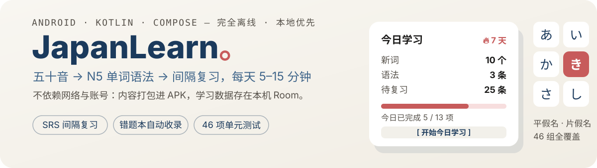
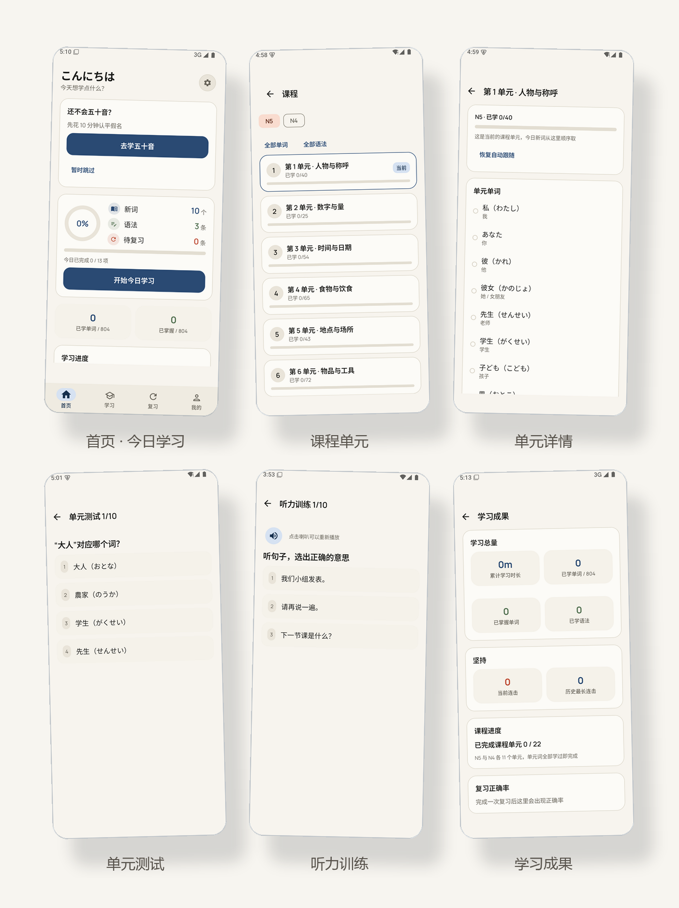
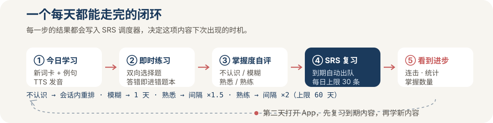

<p align="center">
  
</p>

<p align="center">
  
  
  
  
  <a href="./LICENSE"></a>
</p>

<p align="center">
  
</p>

## 这是什么

JapanLearn 是一个**完全离线、无需账号**的日语入门 App，为日语零基础和备考 JLPT N5/N4 的学习者设计。它把一天的学习压缩成一条固定路径：**沿着课程单元学几个新词 → 马上做一道练习 → 告诉 App 你记住了多少 → 隔天复习**。内容按 N5/N4 各 11 个课程单元组织，配目标日期倒推的个性化每日计划与听力专项训练。整个过程 5–15 分钟，做完就走。

产品需求见 [PRD.md](PRD.md)（§17–§19 为各版本评审决策记录，与正文冲突处以它们为准）。全部 12 张走查截图见 [`.screenshots/`](./.screenshots/)（含深色模式）。

## 为什么不一样

| 常见学习 App | JapanLearn |
|---|---|
| 强制注册登录 | 打开即用，数据存本机 Room，不留任何个人信息 |
| 需要联网加载内容 | 课程内容版本化打包进 APK，飞行模式可完整使用 |
| 发音依赖在线 TTS | 使用系统日语 TTS，零成本、零延迟 |
| 复习量无节制堆积 | 每日复习上限默认 30 条，超出自动顺延，不会压垮用户 |
| 算法黑箱 | 间隔规则全部公开透明，见下表 |

**复习调度**：v0.7 起采用 **FSRS 算法**（vendor 精简移植 [ts-fsrs](https://github.com/open-spaced-repetition/ts-fsrs) v5.4.2，long-term 模式），四档中文自评「不认识 / 模糊 / 熟悉 / 熟练」内部映射 Again/Hard/Good/Easy，间隔按记忆稳定性动态计算；「不认识」仍在本次会话内重新出队并记入错题本。调度器为纯函数，全部单元测试覆盖。

<p align="center">
  
</p>

## 功能总览

| 模块 | 说明 |
|---|---|
| 🏠 今日学习 | 新词 / 语法 / 待复习聚合，实时进度，连击天数 |
| 🈁 五十音 | 101 组（清音 / 浊音 / 拗音），罗马音 + 示例词 + 发音，分组测验，题量可选 |
| 📚 N5/N4 课程 | 22 个课程单元（N5/N4 各 11 个）：单元内顺序学词 + 配套语法，当前单元自动推进，单元测试 10 题检查点 |
| 📖 单词 / 语法全库 | 1104 词（N5 504 + N4 600）+ 120 条语法：假名、词性、例句、接续说明，列表带掌握度色点，可按单元筛选 |
| 🔁 SRS 复习 | 到期自动出队，混合单词与语法，限流顺延 |
| 🔊 听音选词 | 练习中按 30% 概率升级为听音变体（TTS 播放选释义） |
| ⌨️ 打假名 | 中→日约 20% 改为看中文写读音（假名或罗马音） |
| 🔔 复习提醒 | 每天 20:00 检查到期内容，有任务才提醒，可开关 |
| 📝 错题本 | 答错自动收录（含五十音与听力/检查点），复习答对自动移除 |
| ⚡ 错题突击 | 把错题变成练习：答对即清出，每轮 10 题；复习队列中错题优先出队 |
| 📊 学习统计 | 连击、累计时长、近 7 日柱状图、内容进度 |
| 🗾 每日一句 | 180 条场景句（日常 / 餐厅 / 便利店 / 购物 / 交通 / 就医…）带词汇拆解 |
| 🎯 学习目标 | 设 N5/N4 目标与达成日期，按剩余内容量推荐每日新词档位，每周自动校准 |
| 🎧 听力训练 | 听音辨词 / 听写假名 / 听句选义三题型混合，对错同步错题本 |
| 🏆 学习成果 | 累计时长、掌握词数、最长连击、单元完成进度、复习正确率一页看全 |
| 🤖 AI 助手（可选） | 自备 API Key 直连大模型：语法解释 / 句子纠错 / 翻译，流式打字机输出；Key 仅存本机，不配则完全隐藏，每日限额可调 |
| ⚙️ 每日任务量 | 新词（5/10/15/20）、语法数、复习上限可调 |

## 快速开始

要求 JDK 17 + Android SDK Platform 35，Android Studio 直接打开即可运行。

```bash
git clone https://github.com/Ageha6912/JapanLearn.git
cd JapanLearn
./gradlew :app:assembleDebug     # 产出 app/build/outputs/apk/debug/app-debug.apk
./gradlew :app:testDebugUnitTest # 运行单元测试（当前 223 项）
python tools/validate_content.py # 改内容后必须通过
```

不想编译？到 [Releases](https://github.com/Ageha6912/JapanLearn/releases) 下载打包好的 APK 直接安装。

## 发布签名

release 构建自动读取根目录 `keystore.properties` 进行正式签名（该文件与密钥均已 gitignore）：

- 首次配置：`cp keystore.properties.example keystore.properties`，填入你的密钥路径与密码
- 无密钥环境（CI / 新机器）自动退化为未签名 release，`assembleDebug` 不受影响
- ⚠️ `japanlearn-release.jks` 是应用更新身份的唯一凭证：丢失后已安装用户将无法升级，请异地备份（密码管理器 / 私有云盘）

## 设计系统与动效

- **配色（和色）**：藍（主色）× 朱（连续学习/强调）× 抹茶（掌握/成功）× 茜（错误），
  浅色 = 和纸底 `ui/theme/Color.kt`，深色 = 墨夜；掌握度四档语义色经 `LocalJapanColors` 提供
- **字体**：Manrope 可变字体（OFL，`res/font`）负责拉丁/数字，中日文回退系统字体（离线零成本）
- **形状**：统一圆角体系（小 10 / 卡片 20 / 大面板 28），见 `ui/theme/Shape.kt`
- **动效**：`ui/motion/Motion.kt` 统一令牌（强调曲线 + 弹簧物理）——
  级联入场 `StaggerIn`、数字滚动 `AnimatedCounterText`、进度条/环、答题对错反馈（对勾弹出 + 错误摇晃）、
  完成彩带 `ConfettiBurst`、按压物理 `pressScale`、骨架屏 shimmer、页签/二级页差异化导航转场
- **无障碍**：全部动效尊重系统「动画时长缩放 = 0」（减弱动态时退化为静态/即时切换）

## 应用图标

和纸底 + 藍色「あ」+ 圈内朱色点（日の丸意象），与界面设计语言同源：

- 字形轮廓提取自 **Noto Sans JP Bold**（© Google，SIL OFL 1.1），非手绘，字形专业
- 自适应图标（API 26+）：`drawable/ic_launcher_foreground.xml`（字形 + 朱点）、
  `ic_launcher_background.xml`（和纸径向微光）、`ic_launcher_monochrome.xml`（Android 13+ 主题图标）
- 字形已自动适配 66dp 圆形安全区（全部点距画布中心 ≤ 32.5dp，圆形蒙版不裁切）
- 生成脚本与预览：`.icon-work/`（已 gitignore，可随时重新生成）

## 技术与结构

Kotlin 2.0 · Jetpack Compose (Material 3) · Room (KSP) · Navigation Compose · kotlinx-serialization · Coroutines/ViewModel。手工依赖注入（`AppContainer`），无后端、无第三方服务。

```
app/src/main/java/com/japanlearn/app/
├── domain/        # 纯函数业务逻辑：FsrsScheduler / StudyPlanner / CoursePointer / QuizGenerator / ListeningQuizGenerator
├── data/
│   ├── content/   # assets JSON 的 DTO + ContentSeedPlanner
│   ├── local/     # Room 实体 / DAO / 数据库 / 迁移（schema 在 app/schemas）
│   └── repositories/
├── ui/            # home / learn / course / listening / kana / words / grammar / review / stats / profile
└── util/          # DateProvider（可注入时钟）、JapaneseTts
```

## 测试

223 项单元测试全绿（PRD §17.8 强制要求）。改内容须另跑 `python tools/validate_content.py`（CI 已接入）：

- `FsrsSchedulerTest` / `StudyPlannerTest`：FSRS 调度、目标倒推推荐档位与周校准
- `QuizGeneratorTest`：选项数量、含正确答案、不重复、双向词卡、种子可复现、小内容池退化、听音/汉字变体
- `StreakCalculatorTest`：跨天连击、中断归零、今天未学仍延续
- `ReviewPlannerTest`：每日复习限流截断与顺延
- `ContentParsingTest`：内容 JSON schema 解析、假名分组字段与未知字段向前兼容
- `ContentSeedPlannerTest`：分文件版本、legacy 加总 key、删除差集与空 incoming 拒绝
- `ContentScaleTest`：真实 JSON 规模 101 / 804 / 87 / 180 与 22 个课程单元覆盖
- `AppMigrationsTest`：v1→v5 迁移 SQL 与 schema 快照入库
- `ReminderSchedulerTest`：提醒触发时刻计算（当天/顺延/边界）
- `UiMathTest`：今日进度/柱状图占比/入场级联延迟、orphan 进度不计
- `FormatTest`：学习时长展示格式（h/m、负数钳制）
- `CoursePointerTest` / `ListeningQuizGeneratorTest`：当前单元指针、听力三题型配比与回退
- `BackupFileSchemaTest` / `JapaneseTtsTest` / `ThemeModeTest` / `WidgetMathTest` 等

## 内容扩充

课程内容是 4 个带版本号的 JSON 文件，位于 `app/src/main/assets/content/`。追加内容后递增对应文件的 `version`，App 启动时按文件独立重装（学习进度不受影响）：

| 文件 | 内容 | 关键字段 |
|---|---|---|
| `kana.json` | 五十音 | `h / k / r / group` + 示例词 |
| `words.json` | 单词（N5/N4） | `ja / kana / romaji / zh / pos / cat / example / level` |
| `grammar.json` | 语法（N5/N4） | `title / meaning / connection / explanation / examples / exercises / level` |
| `sentences.json` | 每日一句 | `scene / ja / zh / breakdown[]` |

追加语法：`python tools/merge_grammar.py new_grammar_n4_b2.json`。追加每日一句：`python tools/merge_sentences.py new_sentences_b2.json`。合并后必须跑 `python tools/validate_content.py`。

## 路线图

- [x] 单词扩充至 500+，补充浊音 / 拗音（v0.2）
- [x] 每日复习提醒通知（v0.2）
- [x] N4 首批内容、汉字题、备份恢复、桌面小组件（v0.3）
- [x] N4 语法补 7 条、每日一句 120（见 [OPTIMIZATION.md](OPTIMIZATION.md)）
- [x] v0.5.0 装载事务、COUNT、搜索筛选、提醒时刻、五十音横幅、N4 语法与每日一句
- [x] v0.6.1 打假名题 + 按词性干扰项
- [x] v0.7.0 FSRS 间隔复习（自评按钮文案不变）
- [x] v0.7.1 点击发音 TTS（日语本地 voice + 媒体音轨）
- [ ] 登录与多设备同步（可选，非默认路径）
- [ ] SRS 升级为 FSRS 算法（v0.7）
- [ ] AI 日语助手（翻译 / 语法解释 / 纠错，走自建后端）

## 许可证

[MIT](./LICENSE) © Ageha
